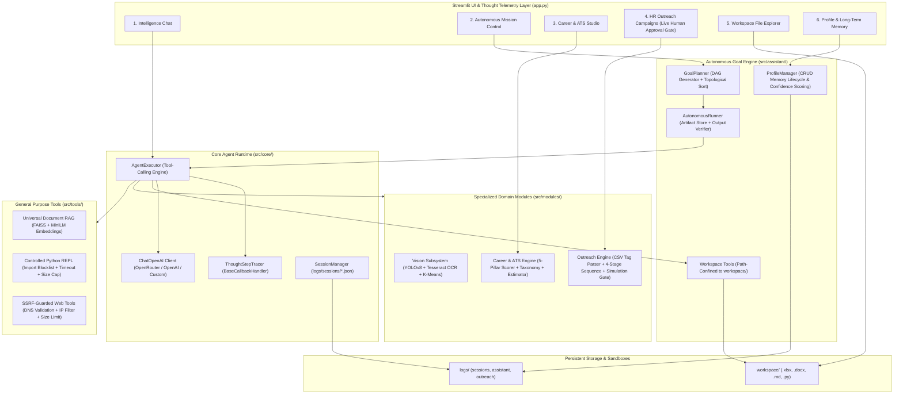
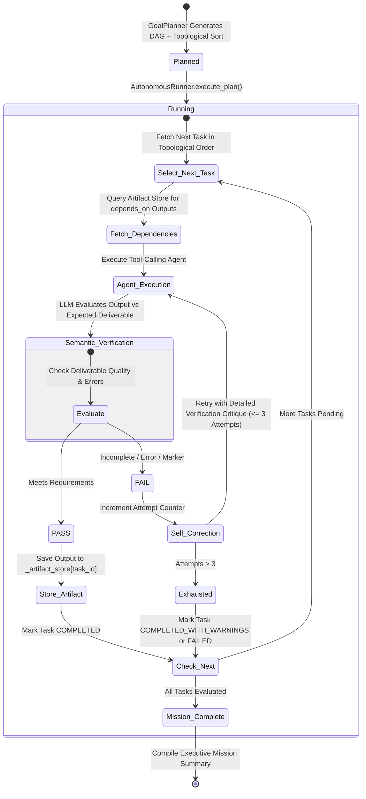
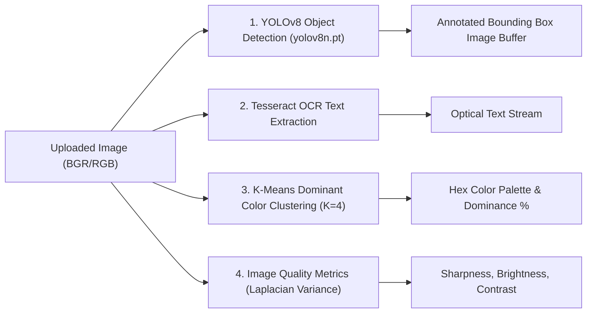

# J.A.R.V.I.S. (Joint Autonomous Real-time Vision & Intelligence System)
## Exhaustive Technical & Algorithmic Engineering Specification

---

## 1. System Architecture & High-Level Design

J.A.R.V.I.S. is engineered as a **Modular Autonomous Agent Framework** combining reactive multi-tool intelligence with dependency-aware goal planning, semantic output verification, multimodal optical perception, statistical data science, HR outreach automation, and enterprise document RAG.

### 1.1. System Dataflow & Execution Topography



---

## 2. Core Agent Runtime & Orchestration (`src/core/`)

### 2.1. Tool-Calling Agent Execution (`src/core/orchestrator.py`)
- **Core Class**: `JarvisOrchestrator`
- **Execution Mechanism**:
  - Initializes `langchain_openai.ChatOpenAI` targeting OpenRouter (`https://openrouter.ai/api/v1`), OpenAI (`api.openai.com`), or custom endpoints.
  - Registers dynamic LangChain tools aggregated across the system:
    1. `src.tools.web_tools`: `duckduckgo_search`, `wikipedia_lookup`, `read_webpage_content`
    2. `src.tools.python_executor`: `python_interpreter`
    3. `src.modules.vision`: `analyze_uploaded_images`
    4. `src.modules.career`: `analyze_resume_and_ats`, `extract_candidate_skills`, `predict_career_salary_and_role`
    5. `src.modules.outreach`: `draft_personalized_outreach`, `generate_multi_stage_sequence`, `preview_campaign_batch`, `dispatch_email_campaign`
    6. `src.assistant.workspace_tools`: `write_workspace_file`, `read_workspace_file`, `list_workspace_files`, `generate_excel_spreadsheet`, `generate_word_document`, `save_personal_memory`
    7. `src.tools.document_tools`: Dynamic FAISS RAG retriever tool created on-demand per document set.
  - Binds prompt templates via `ChatPromptTemplate.from_messages`:
    - `SystemMessage`: System Persona Prompt + User Profile Injected Context.
    - `MessagesPlaceholder(variable_name="chat_history")`.
    - `HumanMessage(content="{input}")`.
    - `MessagesPlaceholder(variable_name="agent_scratchpad")`.
  - Instantiates `create_tool_calling_agent(llm, tools, prompt)` wrapped in `AgentExecutor(agent, tools, verbose=True, max_iterations=12, handle_parsing_errors=True)`.

### 2.2. Thought Telemetry Tracer (`ThoughtStepTracer`)
- Subclasses `BaseCallbackHandler` to intercept execution hooks:
  - `on_tool_start(serialized, input_str, **kwargs)`: Records tool invocation start timestamp and input parameters.
  - `on_tool_end(output, **kwargs)`: Computes execution latency in seconds, extracts output snippets, and packages telemetry into structured event payloads.
  - `on_tool_error(error, **kwargs)`: Intercepts and logs tool exceptions for UI inspection.

### 2.3. Multi-Session Persistence Engine (`src/core/session_manager.py`)
- **Storage Location**: `logs/sessions/{session_id}.json`
- **Data Serialization Contract**:
  ```json
  {
    "session_id": "session_1723812900",
    "persona": "JARVIS Supreme",
    "updated_at": "2026-08-16 19:20:00",
    "messages": [
      {"role": "human", "content": "Analyze competitor landscape."},
      {"role": "ai", "content": "Here is the comprehensive competitor breakdown..."}
    ]
  }
  ```
- **Markdown Transcript Generation**:
  - `SessionManager.export_as_markdown(session_id, messages, persona)` formats session histories with ISO timestamps, role banners (`### USER`, `### JARVIS`), and clean Markdown formatting.

---

## 3. Autonomous Goal Planning & Execution (`src/assistant/`)

### 3.1. Dependency-Aware Goal Decomposition (`src/assistant/goal_planner.py`)
- **Class**: `GoalPlanner`
- **Dependency Graph Schema**:
  ```json
  {
    "goal_summary": "Perform competitor research and generate spreadsheet",
    "estimated_steps": 2,
    "tasks": [
      {
        "id": "task_1",
        "title": "Gather competitor metrics via web search",
        "instruction": "Search DuckDuckGo and Wikipedia for competitor pricing and products.",
        "tool_hint": "web_search",
        "expected_deliverable": "Structured pricing and feature comparison data",
        "depends_on": []
      },
      {
        "id": "task_2",
        "title": "Compile data into Excel workbook",
        "instruction": "Generate Excel workbook with competitor analysis table.",
        "tool_hint": "workspace",
        "expected_deliverable": "competitor_analysis.xlsx saved to workspace",
        "depends_on": ["task_1"]
      }
    ]
  }
  ```
- **Topological Sorting Algorithm (`topological_sort`)**:
  - Implements **Kahn's Algorithm** for Directed Acyclic Graphs (DAGs):
    1. Computes in-degree map $D_{\text{in}}(u)$ and adjacency list $\text{Adj}(u)$ for all task nodes.
    2. Enqueues all nodes with in-degree 0.
    3. Dequeues nodes deterministically (alphabetically by ID), appends to sorted list, and decrements neighbor in-degrees.
    4. Detects dependency cycles: if sorted count $< N_{\text{tasks}}$, logs a warning and falls back safely to the original sequence.

### 3.2. Artifact Store & Semantic Output Verification (`src/assistant/autonomous_runner.py`)
- **Class**: `AutonomousRunner`
- **Execution Architecture**:



- **Artifact Store Pattern (`_artifact_store: Dict[str, str]`)**:
  - Instead of concatenating the entire history of all prior subtasks (which causes quadratic token expansion and context drift), subtask prompts are scoped exclusively to their declared `depends_on` artifacts:
    $$\text{Context}_N = \bigcup_{d \in \text{depends\_on}(N)} \text{ArtifactStore}[d]$$
- **Semantic Output Verification (`_verify_output`)**:
  - After tool execution, the runner initiates an evaluation step prompting the model:
    `"Does this output adequately fulfill the instruction '{instruction}' and expected deliverable '{expected}'? Answer PASS or FAIL with reason."`
  - Rejects empty outputs, unhandled exceptions, and runtime failure markers.
  - Triggers self-correction retries with explicit feedback on failure reasons up to `MAX_RETRY_PER_TASK = 3`.

### 3.3. Workspace File Operations & Deliverable Sandbox (`src/assistant/workspace_tools.py`)
- **Path Confinement Security**:
  - `_resolve_workspace_path(path_str)` strips leading slashes, drive letters, and relative traversal components (`..`), resolving all paths strictly within `d:\Git_Repo\Jarvis\workspace` via `resolved_path.is_relative_to(WORKSPACE_DIR)`.
- **Generators**:
  1. `generate_excel_spreadsheet`: Parses JSON array structures into `pandas.DataFrame` and exports formatted `.xlsx` workbooks via `openpyxl`.
  2. `generate_word_document`: Converts markdown syntax into styled Microsoft Word `.docx` documents via `python-docx`.
  3. `write_workspace_file`: Directly creates workspace files with strict extension filtering (`.py`, `.json`, `.csv`, `.md`, `.txt`).
  4. `read_workspace_file` & `list_workspace_files`: Safe inspection and retrieval utilities.

---

## 4. Computer Vision Subsystem (`src/modules/vision/`)

### 4.1. Visual Data Ingestion & Memory Register
- **Function**: `register_uploaded_image(file)`
- Ingests image bytes from Streamlit file uploaders (JPEG, PNG, WEBP).
- Decodes streams into `PIL.Image` (RGB), converts to NumPy arrays, and constructs OpenCV BGR representations via `cv2.cvtColor(img_np, cv2.COLOR_RGB2BGR)`.
- Caches representations in `_ACTIVE_IMAGES` keyed by filename.

### 4.2. Algorithmic Processing Pipeline (`analyze_image_deep`)



#### A. YOLOv8 Object Localization & Annotation
- **Model**: `yolov8n.pt` (Ultralytics YOLOv8 Nano).
- **Inference**: `model(bgr_img, conf=0.35, verbose=False)[0]`.
- **Annotation Pipeline**:
  - Extracts bounding box coordinates $x_1, y_1, x_2, y_2 = \text{box.xyxy}[0]$.
  - Overlays cyan bounding boxes and confidence text on the image canvas.
  - Converts annotated BGR frames back to RGB and pushes them to `_ANNOTATED_IMAGE_BUFFER` for UI rendering.

#### B. OCR Optical Character Recognition
- Grayscale conversion: `gray = cv2.cvtColor(bgr_img, cv2.COLOR_BGR2GRAY)`.
- Invokes `pytesseract.image_to_string(gray)` to extract printed and handwritten characters.

#### C. K-Means Dominant Color Clustering
- Flattens RGB array to $(N \times 3)$ `np.float32`.
- Executes OpenCV K-Means clustering ($K=4$) with criteria `(TERM_CRITERIA_EPS + MAX_ITER, 20, 1.0)`.
- Computes percentage dominance and generates hex codes `#{R:02x}{G:02x}{B:02x}`.

#### D. Image Sharpness & Blur Estimation
- Computes Discrete Laplacian operator: $\nabla^2 I = \frac{\partial^2 I}{\partial x^2} + \frac{\partial^2 I}{\partial y^2}$.
- Sharpness metric: $\text{Sharpness} = \text{Var}(\text{cv2.Laplacian}(gray, \text{CV\_64F}))$. Blurry if $< 100.0$.
- Computes mean brightness $\mu_{\text{gray}}$ and RMS contrast $\sigma_{\text{gray}}$.

---

## 5. Career Intelligence & 5-Pillar ATS Scoring Model (`src/modules/career/`)

### 5.1. Mathematical 5-Pillar ATS Scoring Model
The ATS Scoring engine evaluates a resume against a target Job Description (JD) using a normalized weighted composite score strictly bounded to $[0, 100]$:

$$\text{ATS Score} = \max\left(0, \min\left(100, \sum_{i} (w_i \times S_i) - w_p \times P_{\text{format}} + B_{\text{recency}} - P_{\text{stuffing}}\right)\right)$$

| Component | Weight ($w$) | Metric ($S_i$) | Score Range | Description |
| :--- | :---: | :--- | :---: | :--- |
| **Skill Match** | $0.40$ | $S_{\text{skills}}$ | $0 - 100$ | Section-aware keyword & semantic overlap across 13 technical skill categories. |
| **Title Match** | $0.20$ | $S_{\text{title}}$ | $0 - 100$ | Role ontology tree matching with seniority alignment. |
| **Experience** | $0.15$ | $S_{\text{exp}}$ | $0 - 100$ | Ratio of candidate years of experience vs. job requirement threshold. |
| **Achievements** | $0.10$ | $S_{\text{achieve}}$ | $0 - 100$ | Ratio of action-verb bullet points featuring quantified metrics (%, $, metrics). |
| **Education** | $0.10$ | $S_{\text{edu}}$ | $0 - 100$ | Candidate highest degree matched against required degree tier. |
| **Format Penalty** | $0.05$ | $P_{\text{format}}$ | $0 - 100$ | Deductions for missing sections, vague dates, or unformatted text. |

### 5.2. Section Weighting & Keyword Frequency Bonus
- **Section Field-Weighting**: Keywords in `experience` (1.5x), `projects` (1.3x), and `achievements` (1.3x) are weighted higher than raw `skills` lists (1.0x).
- **Natural Frequency Bonus**: Keywords appearing 2-4 times across different sections receive a contextual bonus up to $+10$ points. Mentions $\ge 5$ trigger keyword stuffing penalties.

### 5.3. Heuristic Compensation Estimator (`get_salary_and_role_estimate`)
- **Nature of Model**: Deterministic feature-weighted heuristic estimator (not a black-box ML model):
  $$\text{Salary}_{\text{est}} = \text{Base}_{\text{role}} + (\text{Years}_{\text{exp}} \times \text{BandMultiplier}) + \text{DegreeBonus} + (\text{SkillCount} \times \text{SkillMultiplier})$$
- Generates competitive salary bands ($\pm 15\%$) and transparent confidence indicators.

---

## 6. Smart HR Outreach & Cold Email Engine (`src/modules/outreach/`)

### 6.1. Dynamic Recruiter Dataset Normalization & Templating
- Ingests CSV or Excel spreadsheets and normalizes headers (`firstName`, `company`, `role`, `email`).
- Performs dynamic tag replacement using regex `\{([a-zA-Z0-9_]+)\}` with built-in fallbacks.

### 6.2. 4-Stage Multi-Touchpoint Sequence Architecture
```text
Stage 1: Day 1  — Direct Pitch & High-Impact Value Proposition
Stage 2: Day 4  — Technical Value-Add & Architecture / Portfolio Link
Stage 3: Day 8  — Soft Nudge / Top-of-Inbox Check-in
Stage 4: Day 14 — Graceful Breakup / Closing the Loop
```

### 6.3. Mandatory Agent Simulation Gate & Human-in-the-Loop Safety
- **Autonomous Agent Tool Gate**: The LangChain agent tool `dispatch_email_campaign` is **hardcoded to simulation mode (`simulated=True`)**. The `simulated` parameter is not exposed to the model, preventing accidental mass email dispatches.
- **Live SMTP Delivery**: Live SMTP delivery (`simulated=False`) can **only** be triggered through the Streamlit UI with explicit human review and confirmation.

---

## 7. Universal Document & Tabular RAG (`src/tools/document_tools.py`)

### 7.1. Multi-Format Text Ingestion
- **PDF**: `PyPDF2.PdfReader` iterates across document pages with clean page demarcations.
- **Word (.docx)**: `docx.Document` parses paragraphs, bullet items, and table contents.
- **CSV & Excel**: `pandas` and `openpyxl` extract tabular shapes, column types, statistical summaries (`df.describe()`), and Markdown previews.
- **Code & Markdown**: Direct UTF-8 ingestion with fallback encoding handling.

### 7.2. Content Hash Change Detection & Semantic Retrieval
- **Hash Caching**: Computes MD5 hash over concatenated filenames and bytes to avoid redundant vector indexing.
- **Vector Pipeline**: Text chunking via `RecursiveCharacterTextSplitter(chunk_size=1000, overlap=150)`, 384-dimensional dense embeddings via `all-MiniLM-L6-v2`, and in-memory `FAISS` cosine similarity search.

---

## 8. Controlled Python Execution Environment (`src/tools/python_executor.py`)

### 8.1. Execution Isolation & Namespace Restrictions
- **Architecture**: In-process controlled namespace execution environment.
- **Import Blocklist (`BLOCKED_MODULES`)**:
  - Intercepts and blocks dangerous modules: `os`, `subprocess`, `shutil`, `socket`, `ctypes`, `importlib`, `pathlib`, `signal`, `multiprocessing`, `http`, `urllib`, `ftplib`, `smtplib`, `tempfile`, etc.
- **Restricted Builtins (`_build_restricted_builtins`)**:
  - Removes `exec`, `eval`, `compile`, `open`, `breakpoint`, `exit`, `quit` from `__builtins__`.
  - Replaces `__import__` with a filtered hook that rejects blocked modules.
- **Resource Protections**:
  - **Execution Timeout**: 30-second execution cap using thread joining.
  - **Output Size Cap**: Maximum 50 KB stdout/stderr buffer to prevent memory exhaustion.

### 8.2. Inline Figure Interception
- Configures non-interactive Matplotlib backend (`matplotlib.use("Agg")`).
- Intercepts generated figures via `plt.get_fignums()` into `_FIGURE_BUFFER` for automated Streamlit rendering.

---

## 9. Security Architecture & Defensive Guards

| Layer | Threat Vector | Implemented Defensive Control |
| :--- | :--- | :--- |
| **Python Execution** | System compromise, file deletion, subprocessing | Import blocklist, restricted builtins, 30s timeout, 50KB buffer limit. |
| **Web Fetching** | SSRF, internal network scanning, resource exhaustion | Scheme validation (`http/https`), private IP blocking (`127.0.0.0/8`, `10.0.0.0/8`, `192.168.0.0/16`, `::1`), 500KB response cap, max 3 redirects. |
| **Outreach Dispatch** | Autonomous spamming / unauthorized email delivery | Agent tool forced to `simulated=True`; live SMTP requires human UI approval. |
| **Workspace Access** | Path traversal (`../../etc/passwd`) | Strict path confinement via `_resolve_workspace_path` enforcing `is_relative_to(WORKSPACE_DIR)`. |

---

## 10. Personal Profile & Long-Term Memory Lifecycle (`src/assistant/profile_manager.py`)

### 10.1. Memory Entry Data Schema
Each persistent long-term memory record contains structured metadata:
```json
{
  "id": "mem_1723812900000",
  "fact": "Prefers concise, executive-ready technical briefings.",
  "category": "preferences",
  "source": "user_explicit",
  "confidence": 1.0,
  "timestamp": "2026-08-16 21:00:00",
  "updated_at": null
}
```

### 10.2. Full CRUD Lifecycle Support
- `load_memories()`: Loads memories with automatic schema migration for backward compatibility.
- `add_memory(fact, category, source, confidence)`: Creates a new memory with confidence scoring.
- `update_memory(memory_id, new_fact, new_category, new_confidence)`: Updates specific memory fields and records `updated_at` timestamp.
- `delete_memory(memory_id)`: Removes a specific memory entry by unique identifier.
- `clear_memories()`: Clears the entire memory store.
- `get_assistant_system_context()`: Sorts memories by confidence and injects the top 10 most relevant items into the LLM system prompt.

---

## 11. Comprehensive LangChain Tool Catalog

| Tool Name | Module | Parameters | Description |
| :--- | :--- | :--- | :--- |
| `duckduckgo_search` | `src.tools.web_tools` | `query: str` | Real-time web search for current events, news, and external facts. |
| `wikipedia_lookup` | `src.tools.web_tools` | `query: str` | Encyclopedic search and 5-sentence summaries from Wikipedia. |
| `read_webpage_content` | `src.tools.web_tools` | `url: str` | SSRF-guarded text scraper for HTTP/HTTPS web pages. |
| `python_interpreter` | `src.tools.python_executor` | `code: str` | Controlled Python code execution with blocked dangerous imports and chart capture. |
| `analyze_uploaded_images` | `src.modules.vision` | `query: str` | Multimodal YOLOv8 detection, OCR, color palette, and blur metrics. |
| `analyze_resume_and_ats` | `src.modules.career` | `resume_text: str, job_description: str` | 5-pillar ATS scoring, missing keywords, and improvement recommendations. |
| `extract_candidate_skills` | `src.modules.career` | `text: str` | Extracts candidate technical skills across 13 domains. |
| `predict_career_salary_and_role` | `src.modules.career` | `resume_text: str` | Heuristic compensation estimation and role classification from resume text. |
| `draft_personalized_outreach` | `src.modules.outreach` | `recipient_role: str, company: str, candidate_background: str, ...` | Drafts personalized high-converting cold outreach email. |
| `generate_multi_stage_sequence` | `src.modules.outreach` | `target_role: str, target_company: str, candidate_name: str, ...` | Generates 4-stage recruiter follow-up email cadence. |
| `preview_campaign_batch` | `src.modules.outreach` | `subject_template: str, body_template: str, recipients_csv_text: str` | Previews personalized emails across recruiter recipient lists. |
| `dispatch_email_campaign` | `src.modules.outreach` | `subject_template: str, body_template: str, recipients_csv_text: str` | Executes simulated batch email campaign with Excel audit log. |
| `write_workspace_file` | `src.assistant.workspace_tools` | `filename: str, content: str` | Creates or overwrites files inside `workspace/`. |
| `read_workspace_file` | `src.assistant.workspace_tools` | `filename: str` | Reads files from `workspace/`. |
| `list_workspace_files` | `src.assistant.workspace_tools` | *none* | Lists all files and sizes in `workspace/`. |
| `generate_excel_spreadsheet` | `src.assistant.workspace_tools` | `filename: str, json_table_data: str, sheet_name: str` | Generates a styled Excel workbook (`.xlsx`) in `workspace/`. |
| `generate_word_document` | `src.assistant.workspace_tools` | `filename: str, title: str, markdown_content: str` | Generates a styled Word document (`.docx`) in `workspace/`. |
| `save_personal_memory` | `src.assistant.workspace_tools` | `fact: str, category: str` | Appends a persistent fact to the user's long-term memory store. |

---

## 12. Modular Automated Verification Suite (`tests/`)

The repository includes a production-grade automated verification suite composed of **25 dedicated test files** and **127 individual, non-dummy unit and integration tests** organized by subsystem:

### Test Suite Organization

```text
tests/
├── conftest.py                             # Shared fixtures (mock files, dummy images, test resumes)
│
├── core/
│   ├── test_config.py                      # Providers, Models, System Personas
│   ├── test_session_manager.py             # Session CRUD, BaseMessage serialization, Markdown Export
│   ├── test_thought_tracer.py              # Telemetry callbacks, Latency formatting, Output truncation
│   └── test_orchestrator.py                # Full tool aggregation, Prompt binding, Execution init
│
├── assistant/
│   ├── test_goal_planner.py                # Schema, Subtask limits, Fallback plan generation
│   ├── test_topological_sort.py            # Kahn's Algorithm, Linear chains, Diamonds, Cycles, Tie-breaks
│   ├── test_autonomous_runner.py           # Dependency context scoping, Artifact store, Telemetry
│   ├── test_output_verification.py         # PASS evaluations, Rejections on error markers & empty outputs
│   ├── test_profile_manager.py             # Memory CRUD, Confidence clamping, Sorting, Context injection
│   └── test_workspace_tools.py             # Path confinement (traversal attacks), Excel, Word, Script write
│
├── tools/
│   ├── test_python_executor.py             # REPL calculations, Pandas/NumPy, Matplotlib figure capture
│   ├── test_python_security.py             # Import blocklist (os/subprocess/socket), Builtins stripping
│   ├── test_web_tools.py                   # DuckDuckGo search, Wikipedia lookups, HTML parsing
│   ├── test_web_security_ssrf.py           # Scheme filters, Loopbacks (127.0.0.1, ::1), RFC1918 private IPs
│   ├── test_document_parsers.py            # Multi-format parsers (TXT, CSV, DOCX, XLSX, JSON, PY)
│   └── test_document_hash_rag.py           # MD5 content hashing, Mutation detection, Order sensitivity
│
└── modules/
    ├── test_ats_scorer.py                  # 5-Pillar formula, Clamping [0, 100], Deep & Quick scan modes
    ├── test_ats_helpers.py                 # Section detection, Experience duration, Education tier, Metrics
    ├── test_skill_extractor.py             # 13-domain taxonomy, Flat aggregation, Case insensitivity
    ├── test_career_bridge.py               # Standalone profile, Compensation estimation formula
    ├── test_outreach_campaign.py           # Header normalization, Tag replacement, 4-stage cadence
    ├── test_outreach_dispatcher.py         # Email syntax validation, Simulated delivery, Excel audit log
    ├── test_outreach_bridge.py             # Outreach tools, Forced simulation security gate
    ├── test_vision_bridge.py               # Image upload cache, Dimension extraction, Active clear
    └── test_vision_algorithms.py           # Laplacian variance sharpness, Blur detection, K-Means hex
```

To execute the complete test suite:
```bash
pytest tests/ -v
```
**Test Result**: `127 passed, 8 warnings in 51.79s (100% pass rate)`

