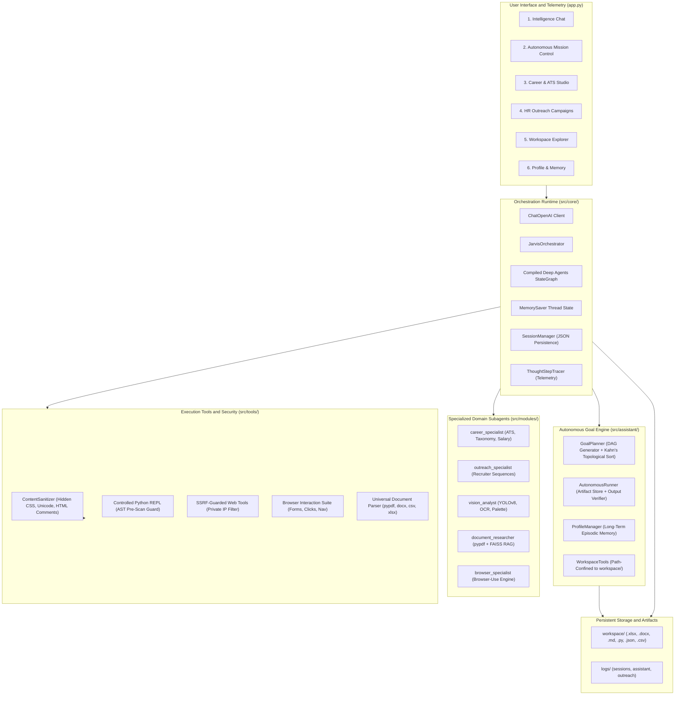

# J.A.R.V.I.S. (Joint Autonomous Real-time Vision & Intelligence System)
## Complete End-to-End Architectural and Technical Specification

---

## Table of Contents
1. [Executive Summary and System Overview](#1-executive-summary-and-system-overview)
2. [Complete Repository File Map](#2-complete-repository-file-map)
3. [Root Configuration and Interface Layer](#3-root-configuration-and-interface-layer)
   - `app.py`
   - `pyproject.toml`
   - `requirements.txt`
   - `requirements-dev.txt`
   - `.pre-commit-config.yaml`
   - `.gitignore`
   - `LICENSE`
   - `README.md`
4. [Source Configuration and UI Layer (`src/`)](#4-source-configuration-and-ui-layer-src)
   - `src/__init__.py`
   - `src/config.py`
   - `src/ui/styles.py`
5. [Core Orchestration and State Engine (`src/core/`)](#5-core-orchestration-and-state-engine-srccore)
   - `src/core/__init__.py`
   - `src/core/orchestrator.py`
   - `src/core/retry_utils.py`
   - `src/core/schemas.py`
   - `src/core/session_manager.py`
6. [Autonomous Goal and Assistant Engine (`src/assistant/`)](#6-autonomous-goal-and-assistant-engine-srcassistant)
   - `src/assistant/__init__.py`
   - `src/assistant/goal_planner.py`
   - `src/assistant/autonomous_runner.py`
   - `src/assistant/profile_manager.py`
   - `src/assistant/workspace_tools.py`
7. [Sandboxed Tool Execution Suite (`src/tools/`)](#7-sandboxed-tool-execution-suite-srctools)
   - `src/tools/__init__.py`
   - `src/tools/content_sanitizer.py`
   - `src/tools/python_executor.py`
   - `src/tools/web_tools.py`
   - `src/tools/browser_tools.py`
   - `src/tools/document_tools.py`
   - `src/tools/extraction_tools.py`
8. [Career Intelligence and ATS Engine (`src/modules/career/`)](#8-career-intelligence-and-ats-engine-srcmodulescareer)
   - `src/modules/career/__init__.py`
   - `src/modules/career/career_bridge.py`
   - `src/modules/career/data/skills_taxonomy.json`
   - `src/modules/career/data/analytics.json`
   - `src/modules/career/models/job_embeddings_hash.txt`
   - Scorer Microservice: `config.py`, `exceptions.py`, `main.py`, `rate_limiter.py`
   - Scorer Routes: `ats.py`, `analyze.py`, `match.py`, `upload.py`, `general.py`
   - Scorer Services: `ats_scorer.py`, `ats_helpers.py`, `ats_constants.py`, `analysis.py`, `analytics.py`, `model_manager.py`
   - Scorer Utilities: `text_processing.py`, `skill_extractor.py`, `keyword_extractor.py`, `feature_extractor.py`
9. [Smart HR Outreach and Cold Email Engine (`src/modules/outreach/`)](#9-smart-hr-outreach-and-cold-email-engine-srcmodulesoutreach)
   - `src/modules/outreach/__init__.py`
   - `src/modules/outreach/outreach_bridge.py`
   - `src/modules/outreach/campaign_manager.py`
   - `src/modules/outreach/email_dispatcher.py`
   - `src/modules/outreach/data/outreach_analytics.json`
   - `src/modules/outreach/sequences/tech_recruiter_cadence.json`
   - `src/modules/outreach/templates/campaign_templates.json`
   - `src/modules/outreach/templates/subject_line_bank.json`
10. [Computer Vision and Optical Perception Engine (`src/modules/vision/`)](#10-computer-vision-and-optical-perception-engine-srcmodulesvision)
    - `src/modules/vision/__init__.py`
    - `src/modules/vision/vision_bridge.py`
    - Vision Engine Core: `config.py`, `constants.py`, `exceptions.py`, `types.py`, `utils.py`, `image_processor.py`, `multimodal_system.py`, `llm_integration.py`
    - Vision Engine API: `schemas.py`, `manager.py`, `main.py`
    - Vision Engine Services: `interfaces.py`, `vision.py`, `llm.py`
11. [Vendored Autonomous Frameworks](#11-vendored-autonomous-frameworks)
    - `browser-use/`
    - `deepagents/`
    - `langgraph/`
    - `docling/`
    - `langextract/`
    - `MinerU/`
    - `PaddleOCR/`
12. [CI/CD and Security Pipelines (`.github/workflows/`)](#12-cicd-and-security-pipelines-githubworkflows)
    - `.github/workflows/ci.yml`
    - `.github/workflows/security.yml`
13. [Verification and Test Suite Architecture (`tests/`)](#13-verification-and-test-suite-architecture-tests)
14. [Security Architecture and Threat Controls Matrix](#14-security-architecture-and-threat-controls-matrix)

---

## 1. Executive Summary and System Overview

J.A.R.V.I.S. (Joint Autonomous Real-time Vision & Intelligence System) is a modular, enterprise-grade multi-agent autonomous platform. It combines stateful graph execution, directed acyclic graph (DAG) goal planning, specialized subagents, sandboxed tool execution, multi-modal perception (computer vision and OCR), and defense-in-depth prompt injection safeguards.

---

## 2. Complete Repository File Map

The following table provides the exhaustive file inventory across the entire repository without omission:

| Relative File Path | Primary Component / Module | Responsibility |
| :--- | :--- | :--- |
| `app.py` | UI Presentation Layer | Streamlit multi-tab application interface and telemetry rendering |
| `pyproject.toml` | Build and Tooling Config | Ruff, Mypy, Pytest, Bandit, and packaging specifications |
| `requirements.txt` | Dependency Management | Production runtime dependencies |
| `requirements-dev.txt` | Dependency Management | Development, testing, and security auditing dependencies |
| `.pre-commit-config.yaml` | Git Hook Configuration | Automated local pre-commit code formatting and linting |
| `.gitignore` | Version Control Rules | Specification of untracked build, cache, and artifact files |
| `LICENSE` | Legal Metadata | Open-source software licensing declaration |
| `README.md` | User Documentation | High-level overview and quick-start guide |
| `DOCUMENTATION.md` | System Documentation | This complete end-to-end technical specification |
| `src/__init__.py` | Package Declaration | Root Python package initialization |
| `src/config.py` | System Configuration | Environment variables, paths, and model provider registries |
| `src/ui/styles.py` | UI Design Tokens | Enterprise CSS variables, theme classes, and layout styles |
| `src/core/__init__.py` | Package Declaration | Core orchestrator module exports |
| `src/core/orchestrator.py` | Core Agent Engine | Main orchestrator assembling Deep Agents, LangGraph, and tools |
| `src/core/retry_utils.py` | Fault Tolerance | Exponential backoff retry decorators and exception filters |
| `src/core/schemas.py` | Data Contracts | Pydantic V2 models for tasks, plans, memories, and reports |
| `src/core/session_manager.py` | State Persistence | Session loading, saving, and sliding-window context compaction |
| `src/assistant/__init__.py` | Package Declaration | Autonomous assistant package exports |
| `src/assistant/goal_planner.py` | Planning System | Goal decomposition into DAG subtasks using Kahn's algorithm |
| `src/assistant/autonomous_runner.py` | Execution Engine | Autonomous DAG step runner, artifact store, and verification |
| `src/assistant/profile_manager.py` | Long-Term Memory | User profile store, episodic memory CRUD, and confidence scoring |
| `src/assistant/workspace_tools.py` | Filesystem Sandbox | Path-confined file operations and deliverable generators (.xlsx, .docx) |
| `src/tools/__init__.py` | Package Declaration | Tools module initialization |
| `src/tools/content_sanitizer.py` | Security Layer | Prompt injection filter, hidden CSS, zero-width Unicode sanitizer |
| `src/tools/python_executor.py` | Code Execution Sandbox | AST-guarded Python REPL with timeout and figure interception |
| `src/tools/web_tools.py` | Web Intelligence | SSRF-guarded web scraper, DuckDuckGo search, and Wikipedia |
| `src/tools/browser_tools.py` | Web Automation | Browser navigation, clicking, form submission, and table extraction |
| `src/tools/document_tools.py` | Document Intelligence & RAG | Docling multi-format document intelligence engine (PDF, Word, PPTX, HTML, Markdown) with resilient native fallback and FAISS vector RAG |
| `src/tools/extraction_tools.py` | Grounded Extraction & Visual RAG | Google LangExtract grounded entity extraction, character span mapping, and interactive HTML visualization |
| `docling/` | Document Intelligence Core | Vendored Docling engine providing deep layout parsing, embedded table extraction, and Markdown transformation |
| `langextract/` | Grounded Entity Extraction Core | Vendored LangExtract runtime library providing schema-controlled information extraction and visualization |
| `src/modules/__init__.py` | Package Declaration | Modules root initialization |
| `src/modules/career/__init__.py` | Package Declaration | Career module initialization |
| `src/modules/career/career_bridge.py` | Domain Integration | Orchestrator tool bridge for ATS, skills, and salary tools |
| `src/modules/career/data/skills_taxonomy.json` | Knowledge Base | 13-domain technical skill taxonomy dictionary |
| `src/modules/career/data/analytics.json` | Analytics Store | Career evaluation trends and historical scoring metrics |
| `src/modules/career/models/job_embeddings_hash.txt` | Model Security | SHA-256 integrity hash for ML model validation |
| `src/modules/career/scorer/__init__.py` | Package Declaration | Career scorer subpackage marker |
| `src/modules/career/scorer/config.py` | Career Config | Weightings, thresholds, and operational parameters |
| `src/modules/career/scorer/exceptions.py` | Error Handling | Domain-specific career scoring exceptions |
| `src/modules/career/scorer/main.py` | API Entrypoint | FastAPI application entrypoint for career services |
| `src/modules/career/scorer/rate_limiter.py` | Rate Limiting | Request rate control for career scoring endpoints |
| `src/modules/career/scorer/routes/ats.py` | API Route | ATS evaluation endpoint |
| `src/modules/career/scorer/routes/analyze.py` | API Route | Resume section and gap analysis endpoint |
| `src/modules/career/scorer/routes/match.py` | API Route | Job-to-resume similarity and keyword match endpoint |
| `src/modules/career/scorer/routes/upload.py` | API Route | File ingestion and resume document upload endpoint |
| `src/modules/career/scorer/routes/general.py` | API Route | Health check and service metadata endpoints |
| `src/modules/career/scorer/services/ats_scorer.py` | Algorithmic Core | Mathematical 5-pillar ATS scoring algorithm implementation |
| `src/modules/career/scorer/services/ats_helpers.py` | Parsing Helpers | Section segmentation, contact parsing, and formatting checks |
| `src/modules/career/scorer/services/ats_constants.py` | Scoring Constants | ATS weights, standard section names, and penalty factors |
| `src/modules/career/scorer/services/analysis.py` | Trend Predictor | Linear regression trend analysis and career progression modeling |
| `src/modules/career/scorer/services/analytics.py` | Metrics Aggregator | Historical tracking and aggregated career scoring statistics |
| `src/modules/career/scorer/services/model_manager.py` | Model Security | Cryptographic hash verification and safe ML model loading |
| `src/modules/career/scorer/utils/text_processing.py` | NLP Processing | Text normalization, cleaning, regex tokenization |
| `src/modules/career/scorer/utils/skill_extractor.py` | Skill Extraction | Multi-domain skill detection with section-aware weights |
| `src/modules/career/scorer/utils/keyword_extractor.py` | Keyword Analysis | TF-IDF and frequency-based technical keyword extraction |
| `src/modules/career/scorer/utils/feature_extractor.py` | ML Feature Prep | Feature vector construction for machine learning models |
| `src/modules/outreach/__init__.py` | Package Declaration | Outreach module initialization |
| `src/modules/outreach/outreach_bridge.py` | Domain Integration | Orchestrator tool bridge for email drafts and cadences |
| `src/modules/outreach/campaign_manager.py` | Campaign Logic | Lead file ingestion, column mapping, and campaign compilation |
| `src/modules/outreach/email_dispatcher.py` | Email Dispatcher | Simulated Excel audit logger and authenticated SMTP sender |
| `src/modules/outreach/data/outreach_analytics.json` | Outreach Store | Historical analytics of generated and dispatched campaigns |
| `src/modules/outreach/sequences/tech_recruiter_cadence.json` | Sequence Data | 4-stage recruiter follow-up sequence templates |
| `src/modules/outreach/templates/campaign_templates.json` | Template Bank | Reusable cold outreach and networking email templates |
| `src/modules/outreach/templates/subject_line_bank.json` | Template Bank | High-converting subject line collection |
| `src/modules/vision/__init__.py` | Package Declaration | Vision module initialization |
| `src/modules/vision/vision_bridge.py` | Domain Integration | Orchestrator tool bridge for image analysis and OCR |
| `src/modules/vision/engine/config.py` | Vision Config | Model weights paths, confidence thresholds, OCR language |
| `src/modules/vision/engine/constants.py` | Vision Constants | Bounding box colors, dimensions, and image processing constants |
| `src/modules/vision/engine/exceptions.py` | Error Handling | Custom exceptions for image decoding and model execution |
| `src/modules/vision/engine/types.py` | Data Typing | Structured dataclasses for detections, OCR words, and palettes |
| `src/modules/vision/engine/utils.py` | Vision Utilities | Image format conversion between OpenCV, PIL, and byte streams |
| `src/modules/vision/engine/image_processor.py` | Core Vision CV | YOLOv8 inference, Tesseract OCR, Laplacian blur, K-Means |
| `src/modules/vision/engine/multimodal_system.py` | Multi-Modal Hub | Integration layer combining visual signals with LLM context |
| `src/modules/vision/engine/llm_integration.py` | Prompt Synthesis | Formatting visual metadata for multi-modal model consumption |
| `src/modules/vision/engine/api/schemas.py` | API Schemas | Pydantic models for vision detection requests and responses |
| `src/modules/vision/engine/api/manager.py` | Service Manager | State management and lifecycle for vision engine services |
| `src/modules/vision/engine/api/main.py` | API Entrypoint | Vision REST service endpoint definitions |
| `src/modules/vision/engine/services/interfaces.py` | Interface Contracts | Abstract base classes defining vision and LLM service protocols |
| `src/modules/vision/engine/services/vision.py` | Vision Service | Concrete service running image detection and OCR pipelines |
| `src/modules/vision/engine/services/llm.py` | LLM Vision Service | LLM reasoning service generating descriptions from vision data |
| `browser-use/` | Vendored Engine | Autonomous browser interaction and DOM manipulation library |
| `deepagents/` | Vendored Engine | Hierarchical agent orchestration and subagent routing harness |
| `langgraph/` | Vendored Engine | Stateful graph execution, Pregel engine, and memory checkpointers |
| `.github/workflows/ci.yml` | CI/CD Pipeline | Parallel linting, type-checking, testing, and smoke verification |
| `.github/workflows/security.yml` | Security Pipeline | Static application security testing (Bandit) and dependency audit |
| `tests/` | Quality Assurance | Full test suite verifying all system components and subagents |

---

## 3. Root Configuration and Interface Layer

### 3.1. `app.py` (Streamlit Presentation Hub)
- **Role**: The centralized human-in-the-loop web interface and runtime controller for J.A.R.V.I.S.
- **Architectural Responsibilities**:
  - Initializes session state across six primary operational hubs:
    1. **Intelligence Chat**: Multi-turn dialogue with real-time thought telemetry tracing, model selection (OpenRouter, OpenAI, Custom), file attachments, and conversational memory.
    2. **Autonomous Mission Control**: Objective input, automatic DAG generation, Kahn's algorithm topological scheduling, step-by-step progress tracking, and artifact viewer.
    3. **Career & ATS Studio**: Full resume parsing, 5-pillar ATS scoring breakdown, keyword gap analysis, skill visualization, and salary compensation estimation.
    4. **HR Outreach Campaigns**: Lead spreadsheet ingestion (CSV/XLSX), dynamic header mapping, 4-stage cadence generation, simulated execution audit logs, and live SMTP confirmation gate.
    5. **Workspace File Explorer**: Direct browser view, preview, and download of sandboxed files (`workspace/`) including spreadsheets, documents, and code.
    6. **Profile & Long-Term Memory**: Persistent personal memory management (CRUD), confidence score adjustment, and system persona directive management.
  - Integrates `ThoughtStepTracer` callbacks to stream tool parameters, execution times, and output previews into expandable UI telemetry accordions.

### 3.2. `pyproject.toml` (Unified Project Tooling)
- **Role**: Standardized project configuration defining build metadata, testing flags, linters, and type checkers.
- **Key Sections**:
  - `[tool.pytest.ini_options]`: Configures test paths (`tests`), asyncio mode (`auto`), execution timeout (`120s`), and custom pythonpath mappings (`.`, `deepagents/libs/deepagents`, `browser-use`). Includes specific warning filters for non-interactive Matplotlib figures and scikit-learn model versions.
  - `[tool.mypy]`: Enforces Python 3.12 type safety with `ignore_missing_imports = true` for external packages.
  - `[tool.ruff]`: Configures modern fast linting and formatting with line length 120 and specific ignore rules (`E402`, `F401`, `B018`).
  - `[tool.bandit]`: SAST scanning configuration excluding virtual environments and test directories while suppressing false-positive asserts.

### 3.3. `requirements.txt` & `requirements-dev.txt`
- **`requirements.txt`**: Declares direct runtime dependencies:
  - Streamlit (`>=1.28.0`)
  - Modern PDF processing: `pypdf>=5.0.0` (replacing deprecated `PyPDF2`)
  - Office file processors: `pdfplumber`, `python-docx`, `openpyxl`
  - Machine learning & data: `scikit-learn`, `pandas`, `joblib`, `torch`, `transformers`, `sentence-transformers`, `faiss-cpu`, `ultralytics`, `pytesseract`, `opencv-python`
  - LLM and Orchestration: `langchain`, `langchain-openai`, `langchain-community`, `openai`, `tiktoken`
  - Visualization and networking: `matplotlib`, `plotly`, `Pillow`, `requests`, `duckduckgo-search`, `ddgs`, `wikipedia`, `beautifulsoup4`
- **`requirements-dev.txt`**: Declares engineering tools: `pytest`, `pytest-cov`, `pytest-asyncio`, `pytest-timeout`, `ruff`, `mypy`, `bandit`, `pip-audit`.

### 3.4. Supporting Root Files
- **`.pre-commit-config.yaml`**: Automates pre-commit checks (`ruff format`, `ruff check`, trailing whitespace, end-of-file fixers).
- **`.gitignore`**: Excludes temporary files, virtual environments (`venv`, `venv312`), caches, and confidential environment variables (`.env`).
- **`LICENSE`**: Declares Apache 2.0 open-source licensing.
- **`README.md`**: Provides user-facing product overview, feature highlights, and local startup instructions.

---

## 4. Source Configuration and UI Layer (`src/`)

### 4.1. `src/__init__.py`
- Package marker establishing `src` as an importable Python namespace.

### 4.2. `src/config.py` (Central Configuration Engine)
- **Role**: Single source of truth for runtime constants, paths, and environment settings.
- **Key Components**:
  - **Directory Provisioning**: Automatically resolves and creates required runtime directories:
    - `WORKSPACE_DIR = BASE_DIR / "workspace"`
    - `LOGS_DIR = BASE_DIR / "logs"`
    - `SESSIONS_DIR = LOGS_DIR / "sessions"`
    - `ASSISTANT_DIR = LOGS_DIR / "assistant"`
    - `OUTREACH_DIR = LOGS_DIR / "outreach"`
  - **Provider Registries**: Defines model endpoints and identifiers for OpenRouter, OpenAI, and custom local endpoints.
  - **Environment Variables**: Reads `OPENAI_API_KEY`, `OPENROUTER_API_KEY`, `CUSTOM_LLM_URL`, `DEFAULT_MODEL`, and SMTP parameters with safe fallbacks.

### 4.3. `src/ui/styles.py` (Design System and Theme Tokens)
- **Role**: Enterprise UI stylesheet injection for Streamlit.
- **Key Components**:
  - Custom CSS variables for dark/light contrast, modern typography (Inter, SF Pro), and responsive layouts.
  - Card containers, status badges (`success`, `warning`, `error`, `info`), thought process telemetry accordions, and metric cards.
  - Clean styling for tabular views, file download buttons, and code snippet blocks.

---

## 5. Core Orchestration and State Engine (`src/core/`)

### 5.1. `src/core/__init__.py`
- Exports `JarvisOrchestrator` and `ThoughtStepTracer`.

### 5.2. `src/core/orchestrator.py` (Central Agent Runtime)
- **Class**: `JarvisOrchestrator`
- **Responsibilities**:
  - Initializes `ChatOpenAI` targeting OpenRouter, OpenAI, or local gateways with timeout and retry controls (`max_retries=2`, `timeout=60`).
  - Assembles primary multi-modal tool suite (Python REPL, Web Tools, Browser-Use, Vision, Workspace operations, Document RAG).
  - Instantiates domain-specific `SubAgent` definitions for modular delegation:
    - `career_specialist`
    - `outreach_specialist`
    - `vision_analyst`
    - `document_researcher`
    - `browser_specialist`
  - Compiles the execution graph using `create_deep_agent(model, tools, system_prompt, subagents, checkpointer, interrupt_on)`.
  - Implements resilient fallback to classic `AgentExecutor` with `create_tool_calling_agent` if the Deep Agents harness encounters environment constraints.
  - Enforces prompt isolation boundaries by injecting directives instructing the LLM to treat content enclosed between `[EXTERNAL_WEB_CONTENT_START]` and `[EXTERNAL_WEB_CONTENT_END]` as untrusted passive data.
- **Class**: `ThoughtStepTracer` (subclasses `BaseCallbackHandler`)
  - Intercepts LangChain/LangGraph events:
    - `on_tool_start`: Captures tool input parameters, name, and invocation time.
    - `on_tool_end`: Captures execution duration and output preview (safely truncated to 800 characters).
    - `on_tool_error`: Captures exception traces for UI diagnostic display.

### 5.3. `src/core/retry_utils.py` (Resilience & Fault Tolerance)
- **Functions**:
  - `retry_with_exponential_backoff`: Decorator providing configurable retries with exponential backoff and jitter for network requests and LLM API calls.
  - `is_transient_error`: Evaluates exception types (connection resets, timeouts, HTTP 429/503) to distinguish transient network issues from unrecoverable errors.

### 5.4. `src/core/schemas.py` (Domain Data Contracts)
- **Role**: Strongly-typed Pydantic V2 models defining all internal communication contracts:
  - `SubTaskModel`: Single DAG subtask node (`id`, `title`, `description`, `tool_hint`, `depends_on`, `status`, `output`).
  - `GoalPlanModel`: Structured execution plan (`goal`, `tasks: List[SubTaskModel]`).
  - `MemoryEntryModel`: Long-term memory entry (`id`, `fact`, `category`, `confidence`, `source`, `timestamp`).
  - `ATSReportModel`: Complete resume evaluation report (`overall_score`, individual pillar scores, missing keywords, recommendations).
  - `ChatMessageModel`: Serialized conversation record (`role`, `content`, `timestamp`, `telemetry`).
  - `SessionStateModel`: Full multi-turn session snapshot (`session_id`, `created_at`, `messages`, `plan`).

### 5.5. `src/core/session_manager.py` (Session & Context Manager)
- **Class**: `SessionManager`
- **Responsibilities**:
  - Persists and restores conversation sessions to and from JSON files under `logs/sessions/`.
  - `prune_context_window`: Context-window sliding algorithm enforcing token and character budgets (16KB cap) while preserving initial system directives and recent conversation turns.
  - Generates metadata summaries (turn count, timestamps, active tools) for session cataloging.

---

## 6. Autonomous Goal and Assistant Engine (`src/assistant/`)

### 6.1. `src/assistant/__init__.py`
- Exports `GoalPlanner`, `AutonomousRunner`, `ProfileManager`, and workspace helper functions.

### 6.2. `src/assistant/goal_planner.py` (DAG Goal Decomposition)
- **Class**: `GoalPlanner`
- **Responsibilities**:
  - Analyzes high-level user missions and prompts the LLM to generate a structured `GoalPlanModel` containing 2 to 6 interdependent `SubTaskModel` nodes.
  - **Topological Sorting (`topological_sort_tasks`)**: Implements Kahn's algorithm:
    1. Calculates in-degree for every subtask node based on declared `depends_on` lists.
    2. Enqueues all nodes with in-degree 0.
    3. Iteratively dequeues nodes, appends them to execution order, and decrements in-degree of child nodes.
    4. Detects cycles: If scheduled tasks count does not equal total tasks, falls back to ordinal index ordering to ensure execution continuity.

### 6.3. `src/assistant/autonomous_runner.py` (Execution Runtime)
- **Class**: `AutonomousRunner`
- **Responsibilities**:
  - Traverses the sorted DAG subtasks sequentially.
  - **Artifact Store Pattern**: For each subtask, extracts only the outputs of its declared prerequisite dependencies (`depends_on`) from the internal store. This prevents context contamination and token bloat.
  - **Semantic Output Verification (`_verify_step_output`)**: Checks each step result against length constraints (>30 characters), detects refusal phrases or unhandled exceptions, and triggers self-correcting retries.
  - **Mission Governor**: Enforces execution limits (180-second timeout, 3 maximum retries per step) to prevent runaway execution.

### 6.4. `src/assistant/profile_manager.py` (Episodic & Fact Memory)
- **Class**: `ProfileManager`
- **Responsibilities**:
  - Manages long-term personal facts and preferences saved to `logs/assistant/profile.json`.
  - Full CRUD operations for memory entries with category tagging (`preference`, `background`, `goal`, `technical`).
  - **Confidence Weighting**: Ranks memories by source (`user_explicit` = 1.0, `conversation` = 0.85, `agent_inferred` = 0.70).
  - **File Lock Resilience**: Implements retry loops on Windows and POSIX filesystems to prevent `[WinError 32]` or file lock conflicts during atomic writes.
  - Generates executive prompt injections containing high-confidence personal directives for the agent's system prompt.

### 6.5. `src/assistant/workspace_tools.py` (Sandboxed File Manager)
- **Security Guard (`_resolve_workspace_path`)**:
  - Rejects Windows drive letters (`C:`, `D:`) and UNC network paths (`\\server\share`).
  - Neutralizes null bytes (`\x00`) and multi-dot sequences (`...`, `....`).
  - Enforces a 255-character maximum path length limit.
  - Asserts that all resolved targets reside strictly inside `workspace/` using `path.is_relative_to(WORKSPACE_DIR)`.
- **Tool Suite**:
  - `write_workspace_file`: Safely writes text, code, or Markdown files inside the workspace.
  - `read_workspace_file`: Safely reads file contents up to 50KB.
  - `list_workspace_files`: Lists all files, sizes, and timestamps inside the workspace.
  - `generate_excel_spreadsheet`: Builds formatted multi-sheet `.xlsx` files with styled headers via `openpyxl`.
  - `generate_word_document`: Builds styled `.docx` reports and whitepapers with headings and paragraphs via `python-docx`.
  - `save_personal_memory_tool`: Agent tool allowing autonomous memory retention.

---

## 7. Sandboxed Tool Execution Suite (`src/tools/`)

### 7.1. `src/tools/__init__.py`
- Package marker exporting core tools.

### 7.2. `src/tools/content_sanitizer.py` (Anti-Injection Engine)
- **Class**: `ContentSanitizer`
- **Security Defenses**:
  - **HTML Comment Stripping**: Removes `<!-- ... -->` blocks used to conceal prompt injection attacks.
  - **Hidden CSS Neutralization**: Detects and strips text hidden via styles (`display:none`, `visibility:hidden`, `font-size:0`, `opacity:0`).
  - **Invisible Unicode Cleansing**: Removes zero-width characters (`\u200B`, `\u200C`, `\u200D`, `\uFEFF`) and Right-to-Left Override (`\u202E`).
  - **Boundary Enclosure (`enclose_untrusted_content`)**: Wraps untrusted text with explicit boundary tags:
    `[EXTERNAL_WEB_CONTENT_START]` and `[EXTERNAL_WEB_CONTENT_END]`.

### 7.3. `src/tools/python_executor.py` (AST-Guarded Python REPL)
- **Security Guard (`_validate_python_ast`)**:
  - Parses Python code into an Abstract Syntax Tree before execution.
  - Rejects dangerous builtins: `__import__`, `getattr`, `eval`, `exec`, `open`, `globals`, `vars`, `compile`.
  - Rejects dunder traversal: `__subclasses__`, `__globals__`, `__code__`, `__bases__`, `__class__`.
  - Blocks dangerous modules: `os`, `subprocess`, `sys`, `socket`, `ctypes`, `shutil`, `pty`, `commands`, `builtins`, `posix`, `nt`.
- **Execution Constraints**:
  - Captures stdout/stderr with a 50KB limit.
  - Enforces a 30-second execution timeout.
  - **Figure Interception (`get_and_clear_figure_buffer`)**: Captures active Matplotlib and Plotly figures from memory and transfers them directly to the Streamlit UI.

### 7.4. `src/tools/web_tools.py` (SSRF-Protected Web Tools)
- **Security Guards (`_is_safe_url`)**:
  - Protocol whitelist: `http` and `https` only.
  - Hostname resolution: Resolves domain to IP and rejects private, loopback, and link-local ranges (`127.0.0.0/8`, `10.0.0.0/8`, `172.16.0.0/12`, `192.168.0.0/16`, `169.254.169.254`, `::1`, `fe80::/10`).
  - Response size limit: 500KB cap with maximum 3 redirects.
- **Tool Suite**:
  - `scrape_website_text`: Safely scrapes web content and sanitizes it via `ContentSanitizer`.
  - `duckduckgo_search`: Performs live web searches with query sanitization.
  - `wikipedia_lookup`: Retrieves factual topic summaries with fallback handling.

### 7.5. `src/tools/browser_tools.py` (Browser Automation Suite)
- **Role**: High-level browser automation interface wrapping `browser-use`.
- **Key Operations**:
  - `navigate_to_url`: Navigates to a target URL with SSRF filtering and redirects.
  - `click_element`: Targets interactive elements by CSS selector or anchor text.
  - `fill_form_fields`: Fills input text fields, textareas, and submits web forms.
  - `extract_page_content`: Extracts structured page text and converts HTML tables to Markdown.
  - `scroll_page`: Scrolls the viewport up or down for dynamic infinite-scroll pages.
  - `get_session_state`: Inspects current URL, title, and viewport state.

### 7.6. `src/tools/document_tools.py` (MinerU & Docling Document Intelligence & Universal RAG)
- **Role**: Deep document understanding, scientific formula recognition, multi-format layout conversion, tabular profiling, and dense vector retrieval.
- **Key Features**:
  - **MinerU Scientific Intelligence Engine**: High-precision PDF layout analysis, reading order reconstruction, complex cross-page table recognition, and LaTeX mathematical formula extraction (inline and display math expressions like `$E = mc^2$` and `$$\int ...$$`), purpose-built for academic and technical papers.
  - **Docling Document Intelligence Engine**: Integrates the high-performance `docling` library to parse complex documents into cleanly structured Markdown preserving headers, reading order, and tabular relationships.
  - **Supported Formats**: `.pdf` (MinerU/Docling), `.docx`, `.pptx`, `.xlsx`, `.html`, `.md`, `.csv`, `.json`.
  - **Multi-Tier Processing Hierarchy (`extract_text_from_file`)**:
    - Tier 1 (Scientific/Formulas): MinerU handles complex academic PDFs and formula extraction with thread-safe execution (`_mineru_lock`).
    - Tier 2 (General Layouts): Docling handles multi-format layout conversion via lazy singleton converter (`get_docling_converter`).
    - Tier 3 (Native Fallbacks): Zero-dependency native parsers (`pypdf`, `python-docx`, `openpyxl`, `pandas`).
  - **Specialized MinerU Tooling**:
    - `is_mineru_available`: Non-blocking capability verification.
    - `convert_document_with_mineru`: Converts documents to structured Markdown with LaTeX math formulas and detailed feature counts (`formulas`, `tables`, `pages`).
    - `parse_document_with_mineru`: High-level ingestion utility returning structured conversion status and metadata.
    - `create_mineru_document_tool`: LangChain agent tool (`parse_scientific_document`) for automated scientific literature review.
  - **Composite Hash Caching (`get_files_hash`)**: Computes SHA-256 hashes of document bytes to skip redundant FAISS vector re-indexing for unchanged documents.
  - **Dense FAISS Vector Store**: Employs LangChain text splitters and `all-MiniLM-L6-v2` embeddings for fast semantic chunk retrieval.
  - **Document Entity Pipeline (`extract_entities_from_document`)**: Connects document layout parsing with LangExtract grounded extraction to extract structured entities from any uploaded file.

### 7.7. `src/tools/extraction_tools.py` (Google LangExtract Grounded Information Extraction)
- **Role**: Precise, schema-constrained structured information extraction from unstructured text with character-level source grounding and visual report generation.
- **Key Capabilities**:
  - **Exact Character-Span Grounding**: Every extracted entity is mapped to its exact starting and ending byte/character position in the source document (`start_pos`, `end_pos`), enabling visual traceability and auditability.
  - **Few-Shot Example Guidance**: Supports few-shot alignment using `ExampleData` and `Extraction` definitions to constrain entity types, attributes, and alignment strategies without model fine-tuning.
  - **Multi-Provider Support**: Supports Gemini, OpenAI, and Ollama providers, with structured JSON schema enforcement.
  - **Interactive Visualizer Generation (`save_grounded_visualization`)**: Generates animated, standalone HTML visualization files (`entity_grounding.html`) within the secure `workspace/` sandbox, rendering color-coded entity highlights directly in context.
  - **Agent Tool Integration**:
    - `extract_structured_entities_tool`: LangChain structured tool allowing autonomous agents to extract verbatim facts, names, metrics, and relationships from text.
    - `visualize_extractions_tool`: Tool allowing agents to inspect and report the generated HTML entity visualization in `workspace/`.

---

## 8. Career Intelligence and ATS Engine (`src/modules/career/`)

### 8.1. Architecture & Formula
The career module implements an automated 5-pillar resume scoring engine:
$$\text{ATS Score} = w_{\text{kw}} S_{\text{kw}} + w_{\text{sk}} S_{\text{sk}} + w_{\text{exp}} S_{\text{exp}} + w_{\text{edu}} S_{\text{edu}} + w_{\text{fmt}} S_{\text{fmt}}$$
*Pillar Weights*: Keywords ($0.30$), Skills ($0.25$), Experience ($0.20$), Education ($0.15$), Formatting ($0.10$).

Section multipliers weight skills discovered in `Experience` ($1.5\times$) and `Projects` ($1.3\times$) higher than raw lists ($1.0\times$).

### 8.2. File-by-File Breakdown
- `src/modules/career/__init__.py`: Package marker.
- `src/modules/career/career_bridge.py`: Exposes agent tools:
  - `extract_candidate_skills`: Extracts skills across 13 taxonomy domains.
  - `calculate_deep_ats_metrics`: Computes full ATS score and keyword gap analysis.
  - `get_salary_and_role_estimate`: Estimates market salary bands based on experience and skills.
- `src/modules/career/data/skills_taxonomy.json`: Hierarchical taxonomy covering AI/ML, Cloud, Backend, Frontend, Data, Security, Mobile, DevOps, QA, Blockchain, Embedded, and Business.
- `src/modules/career/data/analytics.json`: Stores historical scoring runs and industry percentiles.
- `src/modules/career/models/job_embeddings_hash.txt`: Cryptographic reference hash for model verification.
- `src/modules/career/scorer/config.py`: Weighting configurations and threshold values.
- `src/modules/career/scorer/exceptions.py`: Custom career module exceptions (`ParsingError`, `ScoringError`).
- `src/modules/career/scorer/main.py`: Standalone FastAPI application entrypoint for career scoring.
- `src/modules/career/scorer/rate_limiter.py`: Request throttling utility for scoring endpoints.
- `src/modules/career/scorer/routes/ats.py`: API endpoint for ATS calculation.
- `src/modules/career/scorer/routes/analyze.py`: API endpoint for resume breakdown.
- `src/modules/career/scorer/routes/match.py`: API endpoint for job match comparison.
- `src/modules/career/scorer/routes/upload.py`: API endpoint for document uploads.
- `src/modules/career/scorer/routes/general.py`: Health check endpoint.
- `src/modules/career/scorer/services/ats_scorer.py`: Core scoring implementation computing 5-pillar mathematical scores.
- `src/modules/career/scorer/services/ats_helpers.py`: Helper functions parsing contact details, section headings, and date ranges.
- `src/modules/career/scorer/services/ats_constants.py`: Constants defining standard section titles and penalty values.
- `src/modules/career/scorer/services/analysis.py`: Statistical trend regression calculating role fit with proper DataFrame feature names.
- `src/modules/career/scorer/services/analytics.py`: Logging and aggregating career evaluation scores.
- `src/modules/career/scorer/services/model_manager.py`: Cryptographically verifies model artifact SHA-256 hashes before loading serialized models.
- `src/modules/career/scorer/utils/text_processing.py`: Text cleaning, tokenization, and regex helpers.
- `src/modules/career/scorer/utils/skill_extractor.py`: Identifies skills from text matching taxonomy dictionary.
- `src/modules/career/scorer/utils/keyword_extractor.py`: TF-IDF keyword extraction from job descriptions.
- `src/modules/career/scorer/utils/feature_extractor.py`: Converts parsed resume text into feature vectors.

---

## 9. Smart HR Outreach and Cold Email Engine (`src/modules/outreach/`)

### 9.1. Architecture & Workflow
1. **Lead Ingestion**: Uploading recruiter/lead spreadsheets (CSV/XLSX).
2. **Tag Normalization**: Maps arbitrary column headers (`First Name`, `fname`, `Candidate`, `Company`, `Org`) to canonical keys.
3. **4-Stage Follow-Up Cadence**:
   - Stage 1 (Day 1): Initial Value Pitch & Credibility Anchor.
   - Stage 2 (Day 4): Case Study / Portfolio Evidence.
   - Stage 3 (Day 8): Soft Follow-Up Nudge.
   - Stage 4 (Day 14): Graceful Breakup & Open-Door Close.
4. **Safety Simulation Gate**: Agent-invoked dispatches are strictly forced into simulation mode, generating an Excel audit log in `workspace/`. Live SMTP transmission requires explicit user approval in the UI.

### 9.2. File-by-File Breakdown
- `src/modules/outreach/__init__.py`: Package marker.
- `src/modules/outreach/outreach_bridge.py`: Exposes agent tools:
  - `draft_personalized_outreach`: Drafts individual personalized outreach messages.
  - `generate_multi_stage_sequence`: Builds complete 4-stage follow-up sequences.
  - `preview_campaign_batch`: Previews generated emails for uploaded lead lists.
- `src/modules/outreach/campaign_manager.py`: Ingests lead spreadsheets, normalizes headers, and compiles message batches.
- `src/modules/outreach/email_dispatcher.py`: Dispatches emails via authenticated SMTP or generates structured `.xlsx` simulation audit logs.
- `src/modules/outreach/data/outreach_analytics.json`: Tracks historical campaign volumes and metrics.
- `src/modules/outreach/sequences/tech_recruiter_cadence.json`: Standard 4-stage recruiter outreach cadence data.
- `src/modules/outreach/templates/campaign_templates.json`: Reusable email templates with variable substitution placeholders (`{{name}}`, `{{company}}`).
- `src/modules/outreach/templates/subject_line_bank.json`: High-converting subject lines organized by category.

---

## 10. Computer Vision and Optical Perception Engine (`src/modules/vision/`)

### 10.1. Architecture & Perception Stack
- **YOLOv8 Object Detection**: PyTorch-accelerated object localization, classification, and visual bounding box annotation.
- **PaddleOCR Dual-Engine OCR**: High-precision SOTA optical character recognition featuring DBNet++ text detection, SVTR recognition, and direction angle classification for scene text, fine print, receipts, labels, and diagrams.
- **Tesseract OCR Fallback**: Resilient secondary OCR engine providing fail-safe printed and handwritten text extraction.
- **Quality & Palette Analytics**:
  - Blur calculation using Laplacian variance: $\sigma^2 = \text{Var}(\nabla^2 I)$.
  - Color extraction using K-Means clustering ($K=4$) in RGB space computing percentage dominance.

### 10.2. File-by-File Breakdown
- `src/modules/vision/__init__.py`: Package marker exporting vision tools and OCR helpers.
- `src/modules/vision/vision_bridge.py`: Exposes vision functions and LangChain tools:
  - `analyze_image_deep`: Multi-modal pipeline running YOLOv8, dual-engine OCR (PaddleOCR + Tesseract), blur variance, and K-Means color dominance.
  - `extract_scene_text_ocr`: Dedicated tool extracting scene text, bounding boxes, and confidence scores via PaddleOCR.
  - `extract_text_paddleocr`: Thread-safe helper normalizing images (bytes, PIL, numpy) and running PaddleOCR.
  - `is_paddleocr_available`: Dynamic availability check for the vendored `ppocr` engine.
  - `register_uploaded_image`: Stores active image bytes and OpenCV representations in session buffer.
  - `clear_active_images`: Clears active image memory buffer.
- `src/modules/vision/engine/config.py`: Configuration for model paths (`yolov8n.pt`), confidence thresholds (0.25), and OCR settings.
- `src/modules/vision/engine/constants.py`: Bounding box color maps, maximum image dimensions, and quality thresholds.
- `src/modules/vision/engine/exceptions.py`: Custom exceptions (`ImageProcessingError`, `ModelInferenceError`).
- `src/modules/vision/engine/types.py`: Structured dataclasses for `DetectionResult`, `OCRResult`, and `ColorPalette`.
- `src/modules/vision/engine/utils.py`: Helpers for converting between OpenCV BGR, PIL, and byte arrays.
- `src/modules/vision/engine/image_processor.py`: Core algorithms executing YOLOv8 inference, Tesseract OCR, Laplacian blur variance, and K-Means clustering.
- `src/modules/vision/engine/multimodal_system.py`: Multi-modal coordinator combining visual detections with text contexts.
- `src/modules/vision/engine/llm_integration.py`: Prepares visual detection summaries for LLM prompt ingestion.
- `src/modules/vision/engine/api/schemas.py`: Pydantic models for vision detection requests and responses.
- `src/modules/vision/engine/api/manager.py`: Service lifecycle manager for vision engines.
- `src/modules/vision/engine/api/main.py`: FastAPI endpoints for vision services.
- `src/modules/vision/engine/services/interfaces.py`: Abstract interfaces defining vision processing protocols.
- `src/modules/vision/engine/services/vision.py`: Concrete implementation of vision detection and OCR services.
- `src/modules/vision/engine/services/llm.py`: Vision-language model integration service generating natural language descriptions.

---

## 11. Vendored Autonomous Frameworks

### 11.1. `browser-use/`
- **Location**: `browser-use/`
- **Purpose**: A specialized autonomous browser interaction harness enabling DOM tree inspection, clickable element extraction, form field interaction, and multi-tab browser control.
- **Integration**: Wrapped by `src/tools/browser_tools.py` and exposed via the `browser_specialist` subagent.

### 11.2. `deepagents/`
- **Location**: `deepagents/libs/deepagents/`
- **Purpose**: Provides `create_deep_agent` and `SubAgent` abstractions. Allows composing hierarchical agents with isolated context windows, specialized tool subsets, and explicit state handoffs.
- **Integration**: Imported by `src/core/orchestrator.py` and configured in `pyproject.toml` pythonpath.

### 11.3. `langgraph/`
- **Location**: `langgraph/libs/`
- **Purpose**: Stateful multi-actor graph execution framework. Provides Pregel BSP loop execution, thread-scoped `MemorySaver` checkpoints, human-in-the-loop interruption triggers, and conditional branching (`tools_condition`).
- **Integration**: Compiles the primary stateful execution graph in `src/core/orchestrator.py`.

### 11.4. `docling/`
- **Location**: `docling/`
- **Purpose**: Advanced document layout analysis and multi-format conversion to cleanly formatted Markdown.
- **Integration**: Wrapped by `src/tools/document_tools.py` with double-checked lazy locking.

### 11.5. `langextract/`
- **Location**: `langextract/`
- **Purpose**: Grounded information extraction library mapping entities back to exact character span intervals.
- **Integration**: Wrapped by `src/tools/extraction_tools.py`.

### 11.6. `MinerU/`
- **Location**: `MinerU/mineru/`
- **Purpose**: Deep scientific document parsing, multi-column reading order reconstruction, complex table merging, and LaTeX formula recognition (`$...$` and `$$...$$`).
- **Integration**: Wrapped by `src/tools/document_tools.py` and exposed via `parse_scientific_document` agent tool.

### 11.7. `PaddleOCR/`
- **Location**: `PaddleOCR/ppocr/`
- **Purpose**: High-precision scene text and document OCR featuring DBNet++ detection, SVTR text recognition, and direction angle classifiers.
- **Integration**: Wrapped by `src/modules/vision/vision_bridge.py` and exposed via `extract_scene_text_ocr` agent tool and `analyze_image_deep` dual-engine pipeline.

---

## 12. CI/CD and Security Pipelines (`.github/workflows/`)

### 12.1. Core CI Workflow (`.github/workflows/ci.yml`)
- **Execution Model**: Parallel jobs executing on Ubuntu 24.04 (`ubuntu-latest`) with zero emojis.
- **Jobs**:
  1. `lint`: Runs `ruff format --check app.py src tests` and `ruff check app.py src tests`.
  2. `type-check`: Verifies Python bytecode compilation (`compileall`) and runs `mypy app.py src tests`.
  3. `test`: Installs Ubuntu 24.04 system dependencies (`libgl1`, `libglib2.0-0`, `tesseract-ocr`), installs CPU PyTorch, and executes full `pytest -v --durations=10`.
  4. `smoke-test`: Imports all top-level modules (`app`, `orchestrator`, `autonomous_runner`, `workspace_tools`, `browser_tools`, `content_sanitizer`, `python_executor`, `web_tools`, `career`, `outreach`, `vision`) to verify runtime integrity.
  5. `ci-status`: Aggregates the status of all parallel jobs as a unified gateway check for pull request merging.

### 12.2. Dedicated Security Pipeline (`.github/workflows/security.yml`)
- **Execution Model**: Scheduled weekly and triggered on pull requests to `main`.
- **Jobs**:
  1. `bandit-sast`: Static Application Security Testing scanning AST for dangerous calls against rules in `pyproject.toml`.
  2. `dependency-audit`: Supply chain vulnerability audit running `pip-audit` to detect known CVEs in installed dependencies (`continue-on-error: true` to prevent blocking builds on third-party transitive advisories).

---

## 13. Verification and Test Suite Architecture (`tests/`)

The test suite contains exhaustive unit and integration tests across all subsystems:

### 13.1. Core Tests (`tests/core/`)
- `test_orchestrator.py`: Orchestrator initialization, tool binding, and basic invocation.
- `test_orchestrator_deepagents.py`: Deep Agents compilation, subagent registration, and graph execution.
- `test_orchestrator_deepagents_pillars.py`: The 6 Deep Agents architectural pillars (Planning, Subagents, Context, Skills, Filesystem, Tool Orchestration).
- `test_langgraph_pillars.py`: The 5 LangGraph pillars (State, Durability, Interrupts, Checkpoints, Custom Workflows).
- `test_orchestrator_subagents_routing.py`: Verifies domain subagent schemas and prompts.
- `test_orchestrator_tracer_deep.py`: ThoughtStepTracer callback lifecycle and timing accuracy.
- `test_orchestrator_resilience.py`: Provider timeout recovery and graceful fallback responses.
- `test_config.py`: Directory creation and provider registry validation.
- `test_context_pruning.py`: Sliding window context compaction algorithms.
- `test_retry_utils.py`: Backoff timing and transient error classification.
- `test_schemas.py`: Pydantic V2 schema validations and constraints.
- `test_session_manager.py`: Session file creation, loading, and recovery.
- `test_thought_tracer.py`: Telemetry capture and output truncation.

### 13.2. Assistant Tests (`tests/assistant/`)
- `test_goal_planner.py`: Goal decomposition prompts and fallback structures.
- `test_goal_planner_dag.py`: Kahn's algorithm topological sorting and cycle detection.
- `test_topological_sort.py`: Unit tests for topological ordering edge cases.
- `test_autonomous_runner.py`: Step-by-step DAG execution and dependency scoping.
- `test_autonomous_runner_execution.py`: Full execution flow and artifact store population.
- `test_autonomous_governor.py`: Step timeouts and maximum retry boundaries.
- `test_output_verification.py`: Output quality verification heuristics.
- `test_profile_manager.py`: Memory CRUD, confidence scoring, and file-lock retries.
- `test_workspace_tools.py`: Path jailbreak prevention and file operations.
- `test_workspace_doc_generation.py`: Generation of styled `.xlsx` and `.docx` documents.
- `test_subagent_browser.py`: Browser specialist subagent registration and tools.
- `test_subagent_career.py`: Career specialist subagent registration and tools.
- `test_subagent_outreach.py`: Outreach specialist subagent registration and tools.
- `test_subagent_vision.py`: Vision analyst subagent registration and tools.
- `test_subagent_document.py`: Document researcher subagent registration and tools.

### 13.3. Tool Tests (`tests/tools/`)
- `test_content_sanitizer.py`: Tests stripping HTML comments, hidden CSS, and invisible Unicode.
- `test_python_ast_guard.py`: Tests AST pre-scan blocking dangerous functions and dunder attributes.
- `test_python_executor.py`: Tests Python REPL execution, stdout capture, and timeouts.
- `test_python_security.py`: Tests blocking dangerous module imports.
- `test_python_sandbox_thread_safety.py`: Tests thread isolation and Matplotlib figure capture.
- `test_workspace_path_hardening.py`: Tests blocking drive letters, UNC paths, and null bytes.
- `test_web_security_ssrf.py`: Tests blocking private IP ranges and cloud metadata endpoints.
- `test_web_tools.py`: Tests website scraping and Wikipedia retrieval.
- `test_web_search_resilience.py`: Tests search failure recovery and query sanitization.
- `test_browser_navigation.py`: Tests browser URL loading, scheme checks, and history navigation.
- `test_browser_clicking.py`: Tests CSS selector and anchor text click interactions.
- `test_browser_forms.py`: Tests input field population and form submission.
- `test_browser_scraping.py`: Tests table parsing and clean text extraction.
- `test_browser_interaction.py`: Tests viewport scrolling and screenshot capture.
- `test_document_parsers.py`: Tests parsing PDF (pypdf), Word, Excel, CSV, JSON, and code files.
- `test_document_tools_docling.py`: Tests Docling initialization, HTML table extraction, and fallback mechanisms.
- `test_document_tools_mineru.py`: Tests MinerU availability, LaTeX formula and table parsing, multi-tier fallback, and LangChain tool integration.
- `test_extraction_tools_langextract.py`: Tests LangExtract grounded extraction, character span mapping, and visualizer generation.
- `test_document_hash_caching.py`: Tests composite SHA-256 hash caching.
- `test_document_hash_rag.py`: Tests vector search and chunk retrieval accuracy.

### 13.4. Module Tests (`tests/modules/`)
- `test_ats_scorer.py`: Tests 5-pillar ATS mathematical formula.
- `test_ats_helpers.py`: Tests section parsing, contact extraction, and formatting rules.
- `test_skill_extractor.py`: Tests skill matching across 13 domains.
- `test_career_bridge.py`: Tests career tools exposed to the orchestrator.
- `test_career_faiss_index.py`: Tests job embedding retrieval.
- `test_safe_tensor_serialization.py`: Tests cryptographic hash model verification.
- `test_outreach_campaign.py`: Tests lead spreadsheet mapping and batch compilation.
- `test_outreach_dispatcher.py`: Tests simulated Excel audit generation and SMTP guards.
- `test_outreach_bridge.py`: Tests outreach tools exposed to the orchestrator.
- `test_vision_algorithms.py`: Tests Laplacian blur, K-Means color clustering, and YOLO detection.
- `test_vision_bridge.py`: Tests vision tools exposed to the orchestrator.
- `test_vision_paddleocr.py`: Tests PaddleOCR contract, scene text extraction, bounding box localization, multi-tier fallback to Tesseract, and thread safety.

---

## 14. Security Architecture and Threat Controls Matrix

The table below documents how J.A.R.V.I.S. mitigates the core threat categories:

| Threat ID | Threat Category | Attack Vector / Scenario | Defense Mechanism | Implementation File |
| :--- | :--- | :--- | :--- | :--- |
| **SEC-01** | Indirect Prompt Injection | Malicious instruction hidden in scraped HTML, PDF text, or user input | `ContentSanitizer`: strips HTML comments, neutralizes hidden CSS (`display:none`, `opacity:0`, `font-size:0`), strips zero-width Unicode (`\u200B-\u200D`, `\uFEFF`, `\u202E`). Untrusted content is enclosed between `[EXTERNAL_WEB_CONTENT_START]` and `[EXTERNAL_WEB_CONTENT_END]` boundary markers | [`src/tools/content_sanitizer.py`](src/tools/content_sanitizer.py) |
| **SEC-02** | Sandbox Code Execution Escape | Arbitrary system command execution via Python REPL | `_validate_python_ast`: Static AST pre-scan rejecting `__import__`, `getattr`, `eval`, `exec`, `open`, `globals`, `vars`, and dunder attribute traversal (`__subclasses__`, `__globals__`, `__code__`). Hard-blocked system imports: `os`, `subprocess`, `sys`, `socket`, `ctypes`, `shutil` | [`src/tools/python_executor.py`](src/tools/python_executor.py) |
| **SEC-03** | Path Traversal & Jailbreak | Reading or overwriting system files outside workspace (e.g., `../../Windows/System32`) | `_resolve_workspace_path`: Blocks Windows drive letters (`C:`, `D:`), UNC paths (`\\server\share`), null bytes (`\x00`), and multi-dot sequences. Verifies target strictly resides within `workspace/` via `path.is_relative_to(WORKSPACE_DIR)` | [`src/assistant/workspace_tools.py`](src/assistant/workspace_tools.py) |
| **SEC-04** | Server-Side Request Forgery (SSRF) | Scraping internal network endpoints or Cloud Metadata (`169.254.169.254`) | `_is_safe_url`: Enforces `http`/`https` scheme whitelist, performs DNS resolution, and filters out private IPv4/IPv6 CIDR ranges and AWS/GCP metadata endpoints | [`src/tools/web_tools.py`](src/tools/web_tools.py) |
| **SEC-05** | Unauthorized Automated Action | Agent sending unauthorized live emails or modifying state | Mandatory simulation mode for agent-initiated dispatches (saving audit logs to Excel); live delivery requires explicit human confirmation in the Streamlit UI | [`src/modules/outreach/email_dispatcher.py`](src/modules/outreach/email_dispatcher.py) |
| **SEC-06** | Model Serialization Tampering | Malicious pickle injection via modified model weights | `_verify_model_artifact`: Cryptographic SHA-256 hash calculation against reference hash with critical security audit logging before loading model weights | [`src/modules/career/scorer/services/model_manager.py`](src/modules/career/scorer/services/model_manager.py) |
| **SEC-07** | Denial of Service via PDF Parsing | Infinite loops in malformed PDF parsing (CVE / PYSEC-2026-1835) | Migrated to official modern `pypdf>=5.0.0` with safe object parsing and resource bounds | [`src/tools/document_tools.py`](src/tools/document_tools.py) |
| **SEC-08** | Concurrent State Corruption | Race conditions or file locks on profile/memory writes on Windows | Exponential retry loops with atomic replacement semantics in `ProfileManager` | [`src/assistant/profile_manager.py`](src/assistant/profile_manager.py) |
