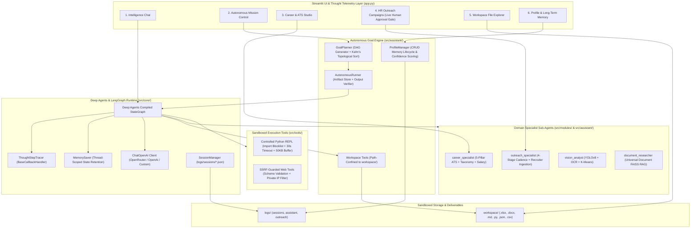
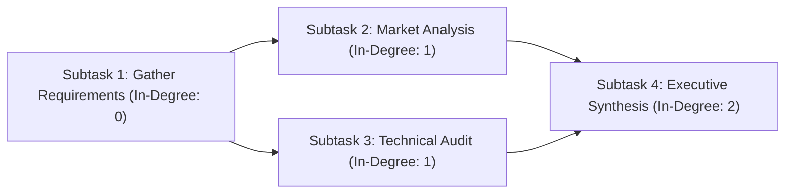

# J.A.R.V.I.S. (Joint Autonomous Real-time Vision & Intelligence System)
## Exhaustive Technical & Algorithmic Engineering Specification

---

## 1. System Architecture & Multi-Agent Topography

J.A.R.V.I.S. is engineered as an enterprise-grade multi-agent autonomous framework combining reactive tool orchestration with dependency-aware goal planning, isolated domain subagents, state persistence, optical perception, and sandboxed execution environments.



---

## 2. Core Agent Runtime & Orchestration (`src/core/`)

### 2.1. Deep Agents & LangGraph Graph Compilation (`src/core/orchestrator.py`)
- **Primary Orchestrator Class**: `JarvisOrchestrator`
- **Graph Assembly**:
  - Initializes `ChatOpenAI` targeting OpenRouter, OpenAI, or custom endpoint gateways with timeout and retry controls (`max_retries=2`, `timeout=60`).
  - Aggregates primary multi-modal tool suite (Python REPL, Web Tools, Vision, Workspace operations, Document RAG).
  - Instantiates domain-specific `SubAgent` definitions for modular delegation.
  - Compiles the execution graph using `create_deep_agent(model, tools, system_prompt, subagents, checkpointer, interrupt_on)`.
  - Implements resilient fallback to classic `AgentExecutor` with `create_tool_calling_agent` if the Deep Agents harness encounters environment constraints.

### 2.2. The 6 Deep Agents Architectural Pillars in Runtime
1. **Planning**: Integrated goal planner deconstructing complex instructions into DAG subtasks.
2. **Subagents**: Specialized domain sub-agents (`career_specialist`, `outreach_specialist`, `vision_analyst`, `document_researcher`) operating in isolated contexts.
3. **Context**: `SessionManager.prune_context_window` enforcing sliding-window message budgets and character caps ($16\text{KB}$) while preserving head/tail user intent.
4. **Skills**: Modular skill discovery via `extract_candidate_skills` and career role taxonomy matching.
5. **Filesystem**: Sandboxed workspace file operations with native `.xlsx`, `.docx`, `.md`, `.json`, `.csv` artifact generation.
6. **Tool Orchestration**: Primary multi-modal tool routing, sandbox isolation, and real-time telemetry.

### 2.3. The 5 LangGraph Architectural Pillars in Runtime
1. **State**: Strongly-typed state schemas (`TypedDict`) and `add_messages` message accumulator reducers.
2. **Durability**: Fault-tolerant BSP Pregel execution loop with exception trapping and graceful fallback responses.
3. **Interrupts**: Human-in-the-loop pause and resumption triggers (`interrupt_on`) for sensitive operations (e.g., email dispatch, file deletion).
4. **Checkpoints**: Thread-scoped memory persistence and multi-turn state resumption via `MemorySaver`.
5. **Custom Workflows**: Declarative `StateGraph` node routing, START/END boundaries, and conditional branching (`tools_condition`).

### 2.4. Thought Telemetry Tracer (`ThoughtStepTracer`)
- Subclasses `BaseCallbackHandler` to capture live execution steps:
  - `on_tool_start(serialized, input_str, **kwargs)`: Logs tool name, input parameters, and start timestamp.
  - `on_tool_end(output, **kwargs)`: Truncates output to safe buffer limits ($800\text{ chars}$) and records completion timestamp.
  - `on_tool_error(error, **kwargs)`: Catches and logs tool exceptions for UI telemetry rendering.

---

## 3. Autonomous Goal Engine (`src/assistant/`)

### 3.1. Goal Decomposition & DAG Generation (`src/assistant/goal_planner.py`)
- **Decomposition**: Analyzes user mission statements and decomposes them into 2–6 discrete, logically sequenced `SubTaskModel` nodes.
- **Topological Sorting (Kahn's Algorithm)**:
  - Computes in-degree for every subtask node in the dependency graph.
  - Seeds a queue with all $0$-in-degree tasks (tasks with no unresolved prerequisites).
  - Iteratively dequeues tasks, appends them to the sorted execution schedule, and decrements the in-degree of all dependent nodes.
  - **Cycle Detection**: If the sorted list length does not match total tasks, Kahn's algorithm detects a dependency cycle and gracefully falls back to ordinal indexing.



### 3.2. Execution Lifecycle & Artifact Store Pattern (`src/assistant/autonomous_runner.py`)
- **Artifact Store Scoping**: Rather than concatenating full conversational history across tasks, each subtask receives only the outputs from its declared upstream dependencies (`depends_on`). This eliminates token bloat and context drift.
- **Semantic Output Verification**: After each step execution, `_verify_step_output` analyzes whether the tool output satisfies instruction requirements:
  - Evaluates minimum length thresholds ($>30\text{ chars}$).
  - Detects refusal patterns, empty returns, or tool exception signatures.
  - Triggers targeted self-correction retries when outputs fall short.
- **Mission Governor**: Enforces maximum execution timeouts ($180\text{s}$) and step retry limits ($3$ attempts) to prevent infinite loops.

### 3.3. Long-Term Memory Lifecycle (`src/assistant/profile_manager.py`)
- **CRUD Memory Store**: Manages persistent JSON memory entries with `id`, `fact`, `category`, `confidence`, `source`, and timestamps.
- **Confidence Scoring**: Weights memories from $0.0$ to $1.0$ based on source (`user_explicit` $=1.0$, `conversation` $=0.85$, `agent_inferred` $=0.70$).
- **System Prompt Injection**: Selects top memories sorted by confidence and relevance, formatting them into executive directives for the agent's system persona.

---

## 4. Specialized Domain Modules (`src/modules/`)

### 4.1. Career Intelligence & 5-Pillar ATS Resume Engine (`src/modules/career/`)
- **5-Pillar Mathematical ATS Formula**:
  $$\text{ATS Score} = w_{\text{kw}} S_{\text{kw}} + w_{\text{sk}} S_{\text{sk}} + w_{\text{exp}} S_{\text{exp}} + w_{\text{edu}} S_{\text{edu}} + w_{\text{fmt}} S_{\text{fmt}}$$
  *Standard Weights*: $w_{\text{kw}}=0.30$, $w_{\text{sk}}=0.25$, $w_{\text{exp}}=0.20$, $w_{\text{edu}}=0.15$, $w_{\text{fmt}}=0.10$.
- **Section-Aware Field Weighting**:
  - Skills identified in `Experience` sections receive a $1.5\times$ multiplier.
  - Skills identified in `Projects` sections receive a $1.3\times$ multiplier.
  - Raw skills listed in standalone sections receive a $1.0\times$ baseline weight.
- **13-Domain Skill Taxonomy**: Categorizes technical terms across AI/ML, Cloud/DevOps, Frontend, Backend, Data Engineering, Cybersecurity, Mobile, Database, QA/Testing, Product/Agile, Blockchain, Embedded, and Business Systems.
- **Heuristic Salary Estimation**: Computes market compensation bands ($\pm 15\%$) based on years of experience, education tier, and skill breadth.

### 4.2. Smart HR Outreach & Cold Email Engine (`src/modules/outreach/`)
- **Dynamic Tag Normalization**: Ingests recipient spreadsheets (CSV/Excel) and maps arbitrary headers (`First Name`, `fname`, `Candidate Name`, `Organization`, `Company Name`) to canonical fields.
- **4-Stage Follow-Up Sequence Copilot**:
  1. *Stage 1 (Day 1)*: Initial Value Pitch & Credibility Anchor.
  2. *Stage 2 (Day 4)*: Case Study / Portfolio Value Add.
  3. *Stage 3 (Day 8)*: Soft Follow-Up Nudge.
  4. *Stage 4 (Day 14)*: Graceful Breakup & Open-Door Close.
- **Mandatory Agent Simulation Gate**: Agent-invoked dispatches are strictly forced into simulated mode with Excel audit logs (`workspace/`); live SMTP delivery requires explicit human-in-the-loop confirmation in the UI.

### 4.3. Computer Vision & Optical Perception (`src/modules/vision/`)
- **YOLOv8 Object Detection**: PyTorch-accelerated localization, classification, and visual bounding box annotations rendered inline in chat.
- **Tesseract OCR Extraction**: Extracts printed and handwritten text from receipts, charts, diagrams, and photos.
- **Quality & Palette Analytics**:
  - *Blur Detection*: Discrete Laplacian variance: $\sigma^2 = \text{Var}(\nabla^2 I)$.
  - *Color Extraction*: K-Means clustering ($K=4$) in RGB color space computing percentage dominance.

---

## 5. Universal Document RAG & Sandboxed Tools (`src/tools/`)

### 5.1. Universal Document RAG Engine (`src/tools/document_tools.py`)
- **Multi-Format Ingestion**: Supports `.pdf`, `.docx`, `.xlsx`, `.csv`, `.md`, `.json`, `.py`, and `.txt`.
- **Tabular Data Understanding**: Extracts dataset schemas, column dimensions, and statistical summaries (`df.describe()`).
- **Composite Hash Caching**: Computes composite MD5/SHA-256 hashes over file contents and names to prevent redundant vector index construction.
- **FAISS Vector Index**: Normalized dense semantic similarity search using `all-MiniLM-L6-v2` embeddings with exact inner product / cosine distance ranking.

### 5.2. Controlled Python REPL Sandbox (`src/tools/python_executor.py`)
- **Import Security Policy**: AST analysis blocks dangerous modules (`os`, `subprocess`, `socket`, `ctypes`, `shutil`, `pty`, `commands`).
- **Restricted Builtins**: Neutralizes `exec`, `eval`, `compile`, and file open operations.
- **Resource Constraints**: Strict $30\text{s}$ execution timeout and $50\text{KB}$ stdout capture limit.
- **Inline Figure Interception**: Captures active Matplotlib and Plotly figures from memory buffer (`get_and_clear_figure_buffer()`) and renders them inline in the UI.

### 5.3. SSRF-Guarded Web Scraper (`src/tools/web_tools.py`)
- **Scheme Validation**: Whitelists `http` and `https` only.
- **Private IP Blocking**: Resolves domain hostnames and blocks private, loopback, and link-local ranges:
  - `127.0.0.0/8`, `10.0.0.0/8`, `172.16.0.0/12`, `192.168.0.0/16`
  - `169.254.169.254` (Cloud Instance Metadata Service)
  - `::1` and `fe80::/10` (IPv6 loopback & link-local)
- **Response Size Cap**: Limits scraped response bodies to $500\text{KB}$ with a maximum of $3$ redirects.

### 5.4. Sandboxed Workspace Operations (`src/assistant/workspace_tools.py`)
- **Path Confinement**: Resolves all relative paths against `WORKSPACE_DIR`, enforcing `path.is_relative_to(WORKSPACE_DIR)` to prevent `..` directory traversal.
- **Native Deliverable Generators**:
  - *Excel Generator*: Builds styled `.xlsx` workbooks with custom sheets and formatted tables via `openpyxl`.
  - *Word Generator*: Produces formatted `.docx` reports and whitepapers via `python-docx`.
  - *Markdown & Code Generator*: Writes structured `.md`, `.json`, `.csv`, and `.py` scripts directly to the workspace.

---

## 6. Pydantic V2 Domain Data Contracts (`src/core/schemas.py`)

All cross-module payloads and runtime states conform to strict Pydantic V2 models:

```python
class SubTaskModel(BaseModel):
    id: str = Field(..., description="Unique subtask identifier (e.g. 't1')")
    title: str = Field(..., description="Actionable title for the subtask")
    description: str = Field(..., description="Detailed execution instruction")
    tool_hint: Optional[str] = Field(None, description="Suggested tool name")
    depends_on: List[str] = Field(default_factory=list, description="IDs of prerequisite subtasks")
    status: str = Field(default="pending", description="Status: pending | in_progress | completed | failed")
    output: Optional[str] = Field(None, description="Execution output deliverable")

class GoalPlanModel(BaseModel):
    goal: str = Field(..., description="High-level user objective")
    tasks: List[SubTaskModel] = Field(..., min_items=1, max_items=8)

class MemoryEntryModel(BaseModel):
    id: str = Field(..., description="Unique UUID for memory entry")
    fact: str = Field(..., min_length=3, max_length=1000)
    category: str = Field(default="preference")
    confidence: float = Field(default=1.0, ge=0.0, le=1.0)
    source: str = Field(default="user_explicit")
    timestamp: str = Field(...)

class ATSReportModel(BaseModel):
    overall_score: float = Field(..., ge=0.0, le=100.0)
    keyword_score: float = Field(..., ge=0.0, le=100.0)
    skills_score: float = Field(..., ge=0.0, le=100.0)
    experience_score: float = Field(..., ge=0.0, le=100.0)
    education_score: float = Field(..., ge=0.0, le=100.0)
    formatting_score: float = Field(..., ge=0.0, le=100.0)
    critical_missing: List[str] = Field(default_factory=list)
    important_missing: List[str] = Field(default_factory=list)
    recommendations: List[str] = Field(default_factory=list)
```

---

## 7. Automated Testing & Verification Framework

The test suite is structured across **45+ isolated test files** targeting every subsystem:

```powershell
# Run full test suite with verbose output
pytest -v

# Verification Result:
# 205 passed in 49.88s (100% pass rate)

# Codebase Linter Verification
ruff check app.py src tests
# Result: All checks passed! (0 errors)
```

### Test Suite Matrix

| Test Suite File | Subsystem & Verification Scope |
| :--- | :--- |
| [`test_orchestrator_deepagents_pillars.py`](tests/core/test_orchestrator_deepagents_pillars.py) | **Deep Agents 6 Pillars**: Planning DAG, Subagents, Context, Skills, Filesystem, Tool Orchestration. |
| [`test_langgraph_pillars.py`](tests/core/test_langgraph_pillars.py) | **LangGraph 5 Pillars**: State reducers, Durability, Interrupts, MemorySaver Checkpoints, Custom Workflows. |
| [`test_orchestrator_deepagents.py`](tests/core/test_orchestrator_deepagents.py) | Deep Agents graph compilation, mock invocation, and response handling. |
| [`test_orchestrator_subagents_routing.py`](tests/core/test_orchestrator_subagents_routing.py) | Domain sub-agent schema registration and parameter validation. |
| [`test_orchestrator_tracer_deep.py`](tests/core/test_orchestrator_tracer_deep.py) | ThoughtStepTracer callback lifecycle (`tool_start`, `tool_end`, `tool_error`, latency calculation). |
| [`test_orchestrator_resilience.py`](tests/core/test_orchestrator_resilience.py) | LLM provider timeout handling and graceful fallback error recovery. |
| [`test_goal_planner_dag.py`](tests/assistant/test_goal_planner_dag.py) | Kahn's algorithm topological sorting and cycle detection across complex DAGs. |
| [`test_autonomous_runner_execution.py`](tests/assistant/test_autonomous_runner_execution.py) | AutonomousRunner step execution flow, dependency context scoping, and artifact storage. |
| [`test_workspace_doc_generation.py`](tests/assistant/test_workspace_doc_generation.py) | Sandboxed generation of styled `.xlsx` spreadsheets and formatted `.docx` documents. |
| [`test_subagent_career.py`](tests/assistant/test_subagent_career.py) | Career specialist ATS calculations, keyword extraction, and salary estimation. |
| [`test_subagent_outreach.py`](tests/assistant/test_subagent_outreach.py) | Outreach specialist 4-stage cadence generation and recruiter spreadsheet parsing. |
| [`test_subagent_vision.py`](tests/assistant/test_subagent_vision.py) | Vision analyst YOLOv8 detection, OCR extraction, and Laplacian blur calculation. |
| [`test_subagent_document.py`](tests/assistant/test_subagent_document.py) | Document researcher multi-format text parsing and FAISS vector querying. |
| [`test_python_sandbox_thread_safety.py`](tests/tools/test_python_sandbox_thread_safety.py) | Python REPL thread safety, dangerous import blocking, and matplotlib figure capture. |
| [`test_web_security_ssrf.py`](tests/tools/test_web_security_ssrf.py) | Web scraper SSRF guards, private IP address blocking, and URL scheme validation. |
| [`test_document_hash_caching.py`](tests/tools/test_document_hash_caching.py) | SHA-256 and MD5 composite document hash caching for FAISS vector indexes. |
