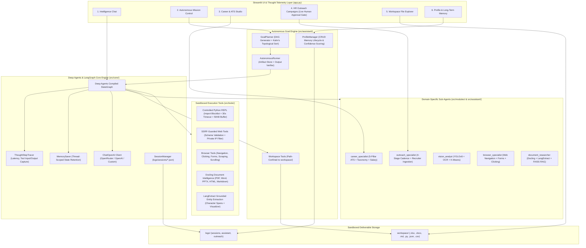

# J.A.R.V.I.S. — Autonomous Multi-Modal Agent Intelligence Platform

[](https://www.python.org/)
[](https://streamlit.io/)
[](https://docs.langchain.com/oss/python/deepagents/overview)
[](https://github.com/langchain-ai/langgraph)
[](https://github.com/browser-use/browser-use)
[](https://github.com/DS4SD/docling)
[](https://github.com/google/langextract)
[](https://github.com/ultralytics/ultralytics)
[](https://github.com/facebookresearch/faiss)
[](https://pytorch.org/)
[](LICENSE)

**J.A.R.V.I.S.** (Joint Autonomous Real-time Vision & Intelligence System) is an enterprise-grade autonomous AI super-intelligence platform and executive personal assistant. Engineered with **Deep Agents**, **LangGraph**, **browser-use**, **Docling**, and **LangExtract**, it empowers users by breaking down high-level human objectives into executable dependency DAGs, delegating tasks to domain-isolated specialist sub-agents, interacting with live web applications, performing deep document intelligence, extracting grounded entities with exact character offsets, and generating real-world deliverables (Microsoft Excel workbooks, Word documents, Markdown briefings, and Python automation scripts) in a secure, sandboxed environment.

---

## System Architecture



---

## Architectural Pillars

J.A.R.V.I.S. integrates curated, enterprise-grade capabilities across its foundational engines:

### The 6 Deep Agents Pillars
1. **Planning**: Autonomous multi-step goal decomposition and Kahn's topological DAG dependency execution.
2. **Subagents**: Isolated domain-specific subagents (`career_specialist`, `outreach_specialist`, `vision_analyst`, `browser_specialist`, `document_researcher`).
3. **Context**: Sliding-window context compaction, token budgeting, and head/tail conversation turn preservation.
4. **Skills**: Modular skill registration, capability discovery, and dynamic ATS taxonomy matching.
5. **Filesystem**: Sandboxed workspace file operations with native `.xlsx`, `.docx`, `.md`, `.json`, `.csv` artifact generation.
6. **Tool Orchestration**: Multi-modal tool execution, sandbox isolation (Python REPL, Web SSRF guards, Browser Automation, Docling, LangExtract, YOLOv8/OCR), and real-time `ThoughtStepTracer` telemetry.

### The 5 LangGraph Pillars
1. **State**: Strongly-typed state schemas (`TypedDict`) and `add_messages` message accumulator reducers.
2. **Durability**: Fault-tolerant BSP Pregel execution loop with resilient fallback error recovery.
3. **Interrupts**: Human-in-the-loop pause and resumption triggers (`interrupt_on`) for high-stakes actions.
4. **Checkpoints**: Thread-scoped memory persistence and multi-turn state resumption via `MemorySaver`.
5. **Custom Workflows**: Declarative `StateGraph` node routing, START/END boundaries, and conditional branching.

### The 5 Browser-Use Capabilities
1. **Web Navigation**: URL navigation, SSRF-guarded domain resolution, session history forward/back, and tab switching.
2. **Clicking**: Interactive element triggering via CSS selectors (`#btn`, `.apply`) and visible text anchors with automatic link redirection.
3. **Forms**: Automated input field population, placeholder matching, textarea handling, and multi-field form submission.
4. **Scraping**: Noise-filtered web content extraction (stripping scripts and styles) and structured HTML-to-Markdown table parsing.
5. **Browser Interaction**: Viewport scrolling (up/down increments), session inspection, and visual telemetry screenshot capture.

---

## Core Product Capabilities

### 1. Autonomous Goal Planning & DAG Execution
- **Topological DAG Decomposition**: Decomposes high-level instructions into executable Directed Acyclic Graphs (DAGs) resolved via Kahn's algorithm with cycle fallback protection.
- **Artifact Store Pattern**: Subtasks receive outputs only from their declared upstream dependencies rather than concatenating full history, eliminating token bloat and context drift.
- **Semantic Output Verification**: After tool execution, the engine evaluates whether deliverables satisfy instruction requirements before proceeding, triggering targeted self-correction retries when outputs fall short.
- **Real-Time Telemetry**: Streams live step progress, execution latency, and intermediate artifacts in the **Autonomous Mission Control** dashboard.

### 2. Autonomous Browser Navigation & Dynamic Web Agency
- **Interactive Web Interactions**: Directly navigates to live web applications, follows links, and clicks action buttons.
- **Form Automation**: Fills multi-field online forms (e.g., job applications, registration portals, surveys) and submits payloads.
- **Dynamic Table Extraction**: Parses client-rendered tables into clean Markdown tables or CSV structures for downstream analysis.
- **Viewport State Telemetry**: Inspects scroll positions and captures visual layout coordinates.

### 3. Smart HR Outreach & Cold Email Engine
- **Dynamic Variable Substitution**: Ingests recipient spreadsheets (CSV/Excel) and normalizes headers (`firstName`, `company`, `role`, `email`) for bulk personalization.
- **4-Stage Follow-Up Sequence Copilot**: Automatically generates structured multi-stage outreach cadences (Day 1 Pitch, Day 4 Value Add, Day 8 Soft Nudge, Day 14 Graceful Breakup).
- **Interactive Recruiter Previewer**: Renders live per-recipient email previews before campaign execution.
- **Mandatory Agent Simulation Gate**: Agent-invoked dispatches are strictly forced into simulated mode with Excel audit logs (`workspace/`); live SMTP delivery requires explicit human-in-the-loop confirmation in the UI.

### 4. Career Intelligence & 5-Pillar ATS Resume Engine
- **Normalized 5-Pillar Scoring**: Evaluates candidate resumes against target job descriptions across Keywords, Skills, Experience, Education, and Formatting, clamped strictly to $[0, 100]$.
- **Section-Aware Field Weighting**: Applies contextual multipliers for skills found in Experience (1.5x) and Projects (1.3x) over raw skills lists.
- **Missing Keyword Detection**: Categorizes missing terms into Critical (required), Important (preferred), and Optional with negation phrase awareness.
- **Heuristic Compensation Estimation**: Calculates transparent market salary bands ($\pm 15\%$) based on years of experience, education tier, and skill breadth.
- **Tailored Resume Generation**: Exports formatted, ATS-optimized Microsoft Word (`.docx`) and Markdown (`.md`) resumes directly to the workspace.

### 5. Workspace File Operations & Deliverable Generation
- **Path-Confined Deliverable Sandbox**: Confines all file operations strictly to the `workspace/` directory with path traversal protection against `..` and drive-letter injections.
- **Microsoft Excel Generator**: Synthesizes structured `.xlsx` workbooks with custom sheets and formatted columns from raw JSON tables.
- **Microsoft Word & Markdown Generator**: Generates formal reports, whitepapers, and briefings in `.docx` and `.md`.
- **Python Automation Generator**: Writes and inspects standalone Python automation scripts.

### 6. Universal Document Intelligence, Grounded Extraction & Data RAG Engine
- **Docling Document Intelligence**: Deep layout and structural parsing for PDF, Word (.docx), PowerPoint (.pptx), HTML, and Markdown, converting complex visual arrangements and tables into cleanly structured Markdown with resilient automatic fallback to native parsers (`pypdf`, `python-docx`, `pandas`).
- **Google LangExtract Grounded Information Extraction**: Extracts structured entities and key attributes from unstructured text with exact character-level source text grounding (`start_pos`, `end_pos`), schema constraints, and automatic generation of interactive HTML visualizer reports in `workspace/`.
- **Tabular Data Understanding**: Automatically extracts dataset schemas, dimensions, and statistical summaries (`df.describe()`).
- **MD5/SHA-256 Content Caching**: Computes composite hashes over file contents and names to eliminate redundant vector embeddings indexing.
- **Vector Retrieval**: Dense semantic similarity search powered by FAISS and `all-MiniLM-L6-v2` embeddings.

### 7. Computer Vision & Optical Intelligence
- **YOLOv8 Object Detection**: Real-time object localization, counting, classification, and visual bounding box annotations rendered inline in chat.
- **Tesseract OCR Text Extraction**: Extracts printed and handwritten text from receipts, charts, diagrams, and photos.
- **Quality & Color Analytics**: Discrete Laplacian variance blur calculation, brightness, contrast, and K-Means dominant color extraction ($K=4$).

### 8. Controlled Python Execution & Visual Analytics
- **Controlled REPL Environment**: Executes calculations, statistical simulations, and data manipulation with blocked dangerous imports (`os`, `subprocess`, `socket`, `ctypes`, `shutil`), restricted builtins, a 30s timeout, and a 50KB output limit.
- **Inline Chart Buffer**: Intercepts generated **Matplotlib and Plotly figures** directly from memory and renders them inline in the UI stream.

### 9. Deep Web & Encyclopedic Research
- **DuckDuckGo Search**: Real-time web queries and news verification.
- **Wikipedia Tool**: Encyclopedic lookups and scientific summaries.
- **SSRF-Guarded Web Scraper**: Fetches full article content with URL scheme validation (`http`/`https`), private/internal IP blocking (`127.0.0.0/8`, `10.0.0.0/8`, `192.168.0.0/16`, `::1`), response size caps (500KB), and redirect limits.

### 10. Personal Profile & Long-Term Memory Lifecycle
- **Customized User Profile**: Configures your name, role, preferred output style, and custom executive directives.
- **Full Memory CRUD Lifecycle**: Full support for adding, updating by ID, deleting by ID, and platform-safe atomic clearing.
- **Confidence Scoring & Source Tracking**: Tracks memory reliability ($0.0 - 1.0$) and origin (`user_explicit`, `conversation`, `agent_inferred`), sorting top memories into system prompt context.
- **Multi-Session Chat**: Save, switch, and export session transcripts to Markdown (`.md`).

---

## Security Architecture & Defensive Controls

| Layer | Threat Vector | Implemented Defensive Control |
| :--- | :--- | :--- |
| **Python Execution** | System compromise, subprocessing, arbitrary code execution | Import blocklist (`os`, `subprocess`, `shutil`, `socket`), restricted `__builtins__`, 30s timeout, 50KB buffer limit. |
| **Model & Tensor Storage** | Arbitrary code execution via Python pickle deserialization | Safe PyTorch tensor serialization (`torch.save` / `torch.load(weights_only=True)`) and compressed `.npz` storage; elimination of raw `.pkl` caching. |
| **Data Contracts & Schemas** | Schema drift, brittle parsing, malformed agent payloads | Strict Pydantic V2 data contracts (`GoalPlanModel`, `SubTaskModel`, `MemoryEntryModel`, `ATSReportModel`, `SystemConfig`). |
| **Web Fetching & Navigation** | SSRF, internal port scanning, cloud metadata access | Scheme validation (`http/https`), private IP blocking (`127.0.0.0/8`, `10.0.0.0/8`, `192.168.0.0/16`, `169.254.169.254`, `::1`), 500KB response cap, max 3 redirects. |
| **Outreach Dispatch** | Autonomous spamming / unauthorized email delivery | Agent tool forced to `simulated=True`; live SMTP delivery requires human confirmation in the UI. |
| **Workspace Access** | Path traversal attacks (`../../etc/passwd`) | Strict path confinement via `_resolve_workspace_path` enforcing `is_relative_to(WORKSPACE_DIR)`. |

---

## UI Workspaces

The application features a sleek frosted-glass interface with 6 dedicated workspaces:
1. **Intelligence Chat**: Multimodal conversational interface with Thought Telemetry, Vision cards, and Python REPL.
2. **Autonomous Mission Control**: Goal assignment input, quick presets, real-time checklist progress, and executive deliverable synthesis.
3. **Career & ATS Studio**: Resume audit, ATS compatibility score gauges, missing keyword chips, compensation estimates, and one-click tailored resume generation.
4. **HR Outreach & Campaigns**: Dynamic spreadsheet recipient parsing, live per-recipient previewer, 4-stage follow-up cadence generator, and campaign execution telemetry with live approval gates.
5. **Workspace Files**: Live file explorer to preview, inspect, and download generated `.xlsx`, `.docx`, `.md`, `.csv`, and `.py` files.
6. **Personal Profile & Memory**: Customize user moniker, role, directives, and manage long-term memories with confidence indicators.

---

## Quick Start

### 1. Prerequisites
- Python 3.10 – 3.12 (Python 3.12 recommended)
- Tesseract OCR (optional, for OCR image text extraction)

### 2. Installation
```bash
# Clone the repository
git clone https://github.com/vutikurishanmukha9/Jarvis.git
cd Jarvis

# Create and activate virtual environment
python -m venv venv312
.\venv312\Scripts\activate

# Install dependencies
pip install -r requirements.txt
```

### 3. Launch J.A.R.V.I.S.
```bash
streamlit run app.py
```
Open your browser at `http://localhost:8501`.

---

## License
Distributed under the MIT License. Built with Streamlit, Deep Agents, LangGraph, browser-use, Docling, LangExtract, PyTorch, YOLOv8, and FAISS.
