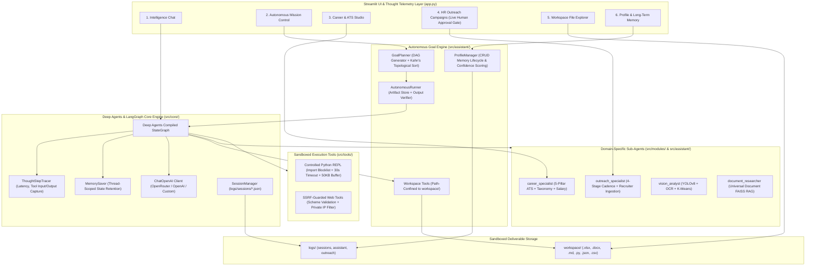

# J.A.R.V.I.S. — Autonomous Multi-Modal Agent Intelligence Platform

[](https://www.python.org/)
[](https://streamlit.io/)
[](https://docs.langchain.com/oss/python/deepagents/overview)
[](https://github.com/langchain-ai/langgraph)
[-brightgreen.svg)](tests/)
[](https://github.com/ultralytics/ultralytics)
[](https://github.com/facebookresearch/faiss)
[](https://pytorch.org/)
[](LICENSE)

**J.A.R.V.I.S.** (Joint Autonomous Real-time Vision & Intelligence System) is an enterprise-grade autonomous AI super-intelligence platform. Powered by **Deep Agents** and **LangGraph**, it executes complex human objectives through dependency-aware execution DAGs, isolated specialist sub-agents, resilient sliding-window context management, modular skill discovery, sandboxed workspace operations, and multi-modal tool orchestration with live thought telemetry.

---

## System Architecture



---

## Architectural Pillars

J.A.R.V.I.S. is architected upon scoped pillars from **Deep Agents** and **LangGraph**:

### The 6 Deep Agents Pillars
1. **Planning**: Multi-step goal decomposition and Kahn's topological DAG dependency execution.
2. **Subagents**: Isolated domain-specific subagents (`career_specialist`, `outreach_specialist`, `vision_analyst`, `document_researcher`).
3. **Context**: Sliding-window context compaction, token budgeting, and head/tail conversation turn preservation.
4. **Skills**: Modular skill registration, capability discovery, and dynamic ATS taxonomy matching.
5. **Filesystem**: Sandboxed workspace file operations with native `.xlsx`, `.docx`, `.md`, `.json`, `.csv` artifact generation.
6. **Tool Orchestration**: Multi-modal tool execution, sandbox isolation (Python REPL, Web SSRF guards, YOLOv8/OCR), and real-time `ThoughtStepTracer` telemetry.

### The 5 LangGraph Pillars
1. **State**: Strongly-typed state schemas (`TypedDict`) and `add_messages` message accumulator reducers.
2. **Durability**: Fault-tolerant BSP Pregel execution loop with resilient fallback error recovery.
3. **Interrupts**: Human-in-the-loop pause and resumption triggers (`interrupt_on`) for high-stakes actions.
4. **Checkpoints**: Thread-scoped memory persistence and multi-turn state resumption via `MemorySaver`.
5. **Custom Workflows**: Declarative `StateGraph` node routing, START/END boundaries, and conditional branching.

---

## Core Capabilities

### 1. Autonomous Goal Planning & DAG Execution
- **Topological DAG Decomposition**: Decomposes high-level instructions into executable Directed Acyclic Graphs (DAGs) resolved via Kahn's algorithm with cycle fallback protection.
- **Artifact Store Pattern**: Subtasks receive outputs only from their declared upstream dependencies rather than concatenating full history, eliminating token bloat and context drift.
- **Semantic Output Verification**: After tool execution, the engine evaluates whether deliverables satisfy instruction requirements before proceeding, triggering targeted self-correction retries when outputs fall short.
- **Real-Time Telemetry**: Streams live step progress, execution latency, and intermediate artifacts in the **Autonomous Mission Control** dashboard.

### 2. Smart HR Outreach & Cold Email Engine
- **Dynamic Variable Substitution**: Ingests recipient spreadsheets (CSV/Excel) and normalizes headers (`firstName`, `company`, `role`, `email`) for bulk personalization.
- **4-Stage Follow-Up Sequence Copilot**: Automatically generates structured multi-stage outreach cadences (Day 1 Pitch, Day 4 Value Add, Day 8 Soft Nudge, Day 14 Graceful Breakup).
- **Interactive Recruiter Previewer**: Renders live per-recipient email previews before campaign execution.
- **Mandatory Agent Simulation Gate**: Agent-invoked dispatches are strictly forced into simulated mode with Excel audit logs (`workspace/`); live SMTP delivery requires explicit human-in-the-loop confirmation in the UI.

### 3. Career Intelligence & 5-Pillar ATS Resume Engine
- **Normalized 5-Pillar Scoring**: Evaluates candidate resumes against target job descriptions across Keywords, Skills, Experience, Education, and Formatting, clamped strictly to $[0, 100]$.
- **Section-Aware Field Weighting**: Applies contextual multipliers for skills found in Experience (1.5x) and Projects (1.3x) over raw skills lists.
- **Missing Keyword Detection**: Categorizes missing terms into Critical (required), Important (preferred), and Optional with negation phrase awareness.
- **Heuristic Compensation Estimation**: Calculates transparent market salary bands ($\pm 15\%$) based on years of experience, education tier, and skill breadth.
- **Tailored Resume Generation**: Exports formatted, ATS-optimized Microsoft Word (`.docx`) and Markdown (`.md`) resumes directly to the workspace.

### 4. Workspace File Operations & Deliverable Generation
- **Path-Confined Deliverable Sandbox**: Confines all file operations strictly to the `workspace/` directory with path traversal protection against `..` and drive-letter injections.
- **Microsoft Excel Generator**: Synthesizes structured `.xlsx` workbooks with custom sheets and formatted columns from raw JSON tables.
- **Microsoft Word & Markdown Generator**: Generates formal reports, whitepapers, and briefings in `.docx` and `.md`.
- **Python Automation Generator**: Writes and inspects standalone Python automation scripts.

### 5. Universal Document & Data RAG Engine
- **Multi-Format Ingestion**: Ingests **PDF, Word (.docx), Excel (.xlsx), CSV, Markdown (.md), JSON, and Code (.py, .txt)**.
- **Tabular Data Understanding**: Automatically extracts dataset schemas, dimensions, and statistical summaries (`df.describe()`).
- **MD5 Content Caching**: Computes composite hashes over file contents and names to eliminate redundant vector embeddings indexing.
- **Vector Retrieval**: Dense semantic similarity search powered by FAISS and `all-MiniLM-L6-v2` embeddings.

### 6. Computer Vision & Optical Intelligence
- **YOLOv8 Object Detection**: Real-time object localization, counting, classification, and visual bounding box annotations rendered inline in chat.
- **Tesseract OCR Text Extraction**: Extracts printed and handwritten text from receipts, charts, diagrams, and photos.
- **Quality & Color Analytics**: Discrete Laplacian variance blur calculation, brightness, contrast, and K-Means dominant color extraction ($K=4$).

### 7. Controlled Python Execution & Visual Analytics
- **Controlled REPL Environment**: Executes calculations, statistical simulations, and data manipulation with blocked dangerous imports (`os`, `subprocess`, `socket`, `ctypes`, `shutil`), restricted builtins, a 30s timeout, and a 50KB output limit.
- **Inline Chart Buffer**: Intercepts generated **Matplotlib and Plotly figures** directly from memory and renders them inline in the UI stream.

### 8. Deep Web & Encyclopedic Research
- **DuckDuckGo Search**: Real-time web queries and news verification.
- **Wikipedia Tool**: Encyclopedic lookups and scientific summaries.
- **SSRF-Guarded Web Scraper**: Fetches full article content with URL scheme validation (`http`/`https`), private/internal IP blocking (`127.0.0.0/8`, `10.0.0.0/8`, `192.168.0.0/16`, `::1`), response size caps (500KB), and redirect limits.

### 9. Personal Profile & Long-Term Memory Lifecycle
- **Customized User Profile**: Configures your name, role, preferred output style, and custom executive directives.
- **Full Memory CRUD Lifecycle**: Full support for adding, updating by ID, deleting by ID, and platform-safe atomic clearing.
- **Confidence Scoring & Source Tracking**: Tracks memory reliability ($0.0 - 1.0$) and origin (`user_explicit`, `conversation`, `agent_inferred`), sorting top memories into system prompt context.
- **Multi-Session Chat**: Save, switch, and export session transcripts to Markdown (`.md`).

---

## Security Architecture & Defensive Controls

| Layer | Threat Vector | Implemented Defensive Control |
| :--- | :--- | :--- |
| **Python Execution** | System compromise, subprocessing, arbitrary code execution | Import blocklist (`os`, `subprocess`, `shutil`, `socket`), restricted `__builtins__`, 30s timeout, 50KB buffer limit. |
| **Model & Tensor Storage** | Arbitrary code execution via Python pickle deserialization | Safe PyTorch tensor serialization (`torch.save` / `torch.load(weights_only=True)`) and compressed `.npz` storage; elimination of raw `.pkl` caching. |
| **Data Contracts & Schemas** | Schema drift, brittle parsing, malformed agent payloads | Strict Pydantic V2 data contracts (`GoalPlanModel`, `SubTaskModel`, `MemoryEntryModel`, `ATSReportModel`, `SystemConfig`). |
| **Web Fetching** | SSRF, internal port scanning, cloud metadata access | Scheme validation (`http/https`), private IP blocking (`127.0.0.0/8`, `10.0.0.0/8`, `192.168.0.0/16`, `169.254.169.254`, `::1`), 500KB response cap, max 3 redirects. |
| **Outreach Dispatch** | Autonomous spamming / unauthorized email delivery | Agent tool forced to `simulated=True`; live SMTP delivery requires human confirmation in the UI. |
| **Workspace Access** | Path traversal attacks (`../../etc/passwd`) | Strict path confinement via `_resolve_workspace_path` enforcing `is_relative_to(WORKSPACE_DIR)`. |

---

## Quick Start

### 1. Prerequisites
- Python 3.10 – 3.12 (Python 3.12 recommended)
- Tesseract OCR (optional, for OCR image text extraction)

### 2. Installation
```bash
# Clone the repository
git clone https://github.com/vutikurishanmukha9/Jarvis.git
cd Jarvis

# Create and activate virtual environment
python -m venv venv312
.\venv312\Scripts\activate

# Install dependencies
pip install -r requirements.txt
```

### 3. Launch J.A.R.V.I.S.
```bash
streamlit run app.py
```
Open your browser at `http://localhost:8501`.

---

## Modular Automated Test Suite

Run the full production test suite:
```bash
pytest -v
```

### Test Coverage Highlights (205 Tests Across 45+ Isolated Test Files — 100% Pass Rate):
- **Core Engine & Architecture**: Deep Agents 6-pillar verification ([test_orchestrator_deepagents_pillars.py](tests/core/test_orchestrator_deepagents_pillars.py)), LangGraph 5-pillar verification ([test_langgraph_pillars.py](tests/core/test_langgraph_pillars.py)), Deep Agents graph execution ([test_orchestrator_deepagents.py](tests/core/test_orchestrator_deepagents.py)), sub-agent routing ([test_orchestrator_subagents_routing.py](tests/core/test_orchestrator_subagents_routing.py)), ThoughtStep tracer telemetry ([test_orchestrator_tracer_deep.py](tests/core/test_orchestrator_tracer_deep.py)), error resilience ([test_orchestrator_resilience.py](tests/core/test_orchestrator_resilience.py)), sliding-window context compression ([test_context_pruning.py](tests/core/test_context_pruning.py)), session management ([test_session_manager.py](tests/core/test_session_manager.py)), and Pydantic schemas ([test_schemas.py](tests/core/test_schemas.py)).
- **Autonomous Mission Control**: Goal decomposition schemas ([test_goal_planner.py](tests/assistant/test_goal_planner.py)), DAG topological sorting ([test_goal_planner_dag.py](tests/assistant/test_goal_planner_dag.py), [test_topological_sort.py](tests/assistant/test_topological_sort.py)), mission runner execution ([test_autonomous_runner_execution.py](tests/assistant/test_autonomous_runner_execution.py)), mission governor timeouts ([test_autonomous_governor.py](tests/assistant/test_autonomous_governor.py)), output verification ([test_output_verification.py](tests/assistant/test_output_verification.py)), memory CRUD lifecycle ([test_profile_manager.py](tests/assistant/test_profile_manager.py)), and document deliverable generation ([test_workspace_doc_generation.py](tests/assistant/test_workspace_doc_generation.py)).
- **Specialized Sub-Agents & Modules**: Career specialist ([test_subagent_career.py](tests/assistant/test_subagent_career.py), [test_ats_scorer.py](tests/modules/test_ats_scorer.py), [test_career_bridge.py](tests/modules/test_career_bridge.py)), outreach specialist ([test_subagent_outreach.py](tests/assistant/test_subagent_outreach.py), [test_outreach_dispatcher.py](tests/modules/test_outreach_dispatcher.py)), vision analyst ([test_subagent_vision.py](tests/assistant/test_subagent_vision.py), [test_vision_algorithms.py](tests/modules/test_vision_algorithms.py), [test_vision_bridge.py](tests/modules/test_vision_bridge.py)), and document researcher ([test_subagent_document.py](tests/assistant/test_subagent_document.py), [test_career_faiss_index.py](tests/modules/test_career_faiss_index.py)).
- **Sandboxed Execution & Security**: Controlled Python REPL thread safety ([test_python_sandbox_thread_safety.py](tests/tools/test_python_sandbox_thread_safety.py)), Python dangerous import blocking ([test_python_security.py](tests/tools/test_python_security.py)), SSRF web security validation ([test_web_security_ssrf.py](tests/tools/test_web_security_ssrf.py), [test_web_search_resilience.py](tests/tools/test_web_search_resilience.py)), document parsing ([test_document_parsers.py](tests/tools/test_document_parsers.py)), and SHA-256 caching ([test_document_hash_caching.py](tests/tools/test_document_hash_caching.py)).

---

## License
Distributed under the MIT License. Built with Streamlit, Deep Agents, LangGraph, PyTorch, YOLOv8, and FAISS.
