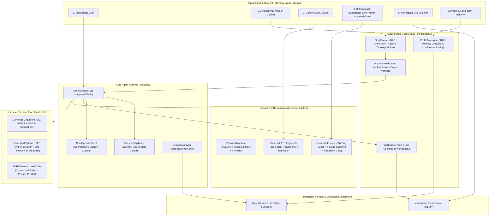

# J.A.R.V.I.S. — Autonomous Multimodal Intelligence & Personal Assistant System

[](https://www.python.org/)
[](https://streamlit.io/)
[](https://www.langchain.com/)
[](tests/)
[](https://github.com/ultralytics/ultralytics)
[](https://github.com/facebookresearch/faiss)
[](https://pytorch.org/)
[](LICENSE)

**J.A.R.V.I.S.** (Joint Autonomous Real-time Vision & Intelligence System) is an enterprise-grade autonomous AI personal assistant and multimodal super-intelligence platform. It breaks down complex human objectives into dependency-aware execution DAGs, autonomously runs multi-step workflows with semantic output verification, generates real-world deliverables (Microsoft Excel workbooks, Word documents, Markdown briefings, Python scripts), audits ATS resume compatibility, orchestrates personalized HR email campaigns with built-in safety controls, extracts optical telemetry with YOLOv8 & OCR, and manages persistent long-term memory across sessions.

---

## System Architecture



---

## Core Capabilities

### 1. Autonomous Goal Planning & Dependency-Aware Execution
- **Topological DAG Decomposition**: Decomposes high-level instructions into executable Directed Acyclic Graphs (DAGs) resolved via Kahn's algorithm with cycle fallback protection.
- **Artifact Store Pattern**: Subtasks receive only the outputs from their declared upstream dependencies rather than concatenating full history, eliminating token bloat and context drift.
- **Semantic Output Verification**: After tool execution, the engine evaluates whether deliverables satisfy instruction requirements before proceeding, triggering targeted self-correction retries when outputs fall short.
- **Real-Time Telemetry**: Streams live step progress, execution latency, and intermediate artifacts in the **Autonomous Mission Control** dashboard.

### 2. Smart HR Outreach & Cold Email Engine
- **Dynamic Variable Substitution**: Ingests recipient spreadsheets (CSV/Excel) and normalizes headers (`firstName`, `company`, `role`, `email`) for bulk personalization.
- **4-Stage Follow-Up Sequence Copilot**: Automatically generates structured multi-stage outreach cadences (Day 1 Pitch, Day 4 Value Add, Day 8 Soft Nudge, Day 14 Graceful Breakup).
- **Interactive Recruiter Previewer**: Renders live per-recipient email previews before campaign execution.
- **Mandatory Agent Simulation Gate**: Agent-invoked dispatches are strictly forced into simulated mode with Excel audit logs (`workspace/`); live SMTP delivery requires explicit human-in-the-loop confirmation in the UI.

### 3. Career Intelligence & 5-Pillar ATS Resume Engine
- **Normalized 5-Pillar Scoring**: Evaluates candidate resumes against target job descriptions across Keywords, Skills, Experience, Education, and Formatting, clamped strictly to $[0, 100]$.
- **Section-Aware Field Weighting**: Applies contextual multipliers for skills found in Experience (1.5x) and Projects (1.3x) over raw skills lists.
- **Missing Keyword Detection**: Categorizes missing terms into Critical (required), Important (preferred), and Optional with negation phrase awareness.
- **Heuristic Compensation Estimation**: Calculates transparent market salary bands ($\pm 15\%$) based on years of experience, education tier, and skill breadth.
- **Tailored Resume Generation**: Exports formatted, ATS-optimized Microsoft Word (`.docx`) and Markdown (`.md`) resumes directly to the workspace.

### 4. Workspace File Operations & Deliverable Generation
- **Path-Confined Deliverable Sandbox**: Confines all file operations strictly to the `workspace/` directory with path traversal protection against `..` and drive-letter injections.
- **Microsoft Excel Generator**: Synthesizes structured `.xlsx` workbooks with custom sheets and formatted columns from raw JSON tables.
- **Microsoft Word & Markdown Generator**: Generates formal reports, whitepapers, and briefings in `.docx` and `.md`.
- **Python Automation Generator**: Writes and inspects standalone Python automation scripts.

### 5. Universal Document & Data RAG Engine
- **Multi-Format Ingestion**: Ingests **PDF, Word (.docx), Excel (.xlsx), CSV, Markdown (.md), JSON, and Code (.py, .txt)**.
- **Tabular Data Understanding**: Automatically extracts dataset schemas, dimensions, and statistical summaries (`df.describe()`).
- **MD5 Content Caching**: Computes composite hashes over file contents and names to eliminate redundant vector embeddings indexing.
- **Vector Retrieval**: Dense semantic similarity search powered by FAISS and `all-MiniLM-L6-v2` embeddings.

### 6. Computer Vision & Optical Intelligence
- **YOLOv8 Object Detection**: Real-time object localization, counting, classification, and visual bounding box annotations rendered inline in chat.
- **Tesseract OCR Text Extraction**: Extracts printed and handwritten text from receipts, charts, diagrams, and photos.
- **Quality & Color Analytics**: Discrete Laplacian variance blur calculation, brightness, contrast, and K-Means dominant color extraction ($K=4$).

### 7. Controlled Python Execution & Visual Analytics
- **Controlled REPL Environment**: Executes calculations, statistical simulations, and data manipulation with blocked dangerous imports (`os`, `subprocess`, `socket`, `ctypes`, `shutil`), restricted builtins, a 30s timeout, and a 50KB output limit.
- **Inline Chart Buffer**: Intercepts generated **Matplotlib and Plotly figures** directly from memory and renders them inline in the UI stream.

### 8. Deep Web & Encyclopedic Research
- **DuckDuckGo Search**: Real-time web queries and news verification.
- **Wikipedia Tool**: Encyclopedic lookups and scientific summaries.
- **SSRF-Guarded Web Scraper**: Fetches full article content with URL scheme validation (`http`/`https`), private/internal IP blocking (`127.0.0.0/8`, `10.0.0.0/8`, `192.168.0.0/16`, `::1`), response size caps (500KB), and redirect limits.

### 9. Personal Profile & Long-Term Memory Lifecycle
- **Customized User Profile**: Configures your name, role, preferred output style, and custom executive directives.
- **Full Memory CRUD Lifecycle**: Full support for adding, updating by ID, deleting by ID, and platform-safe atomic clearing.
- **Confidence Scoring & Source Tracking**: Tracks memory reliability ($0.0 - 1.0$) and origin (`user_explicit`, `conversation`, `agent_inferred`), sorting top memories into system prompt context.
- **Multi-Session Chat**: Save, switch, and export session transcripts to Markdown (`.md`).

---

## Security Architecture & Defensive Guards

| Layer | Threat Vector | Implemented Defensive Control |
| :--- | :--- | :--- |
| **Python Execution** | System compromise, subprocessing, arbitrary code execution | Import blocklist (`os`, `subprocess`, `shutil`, `socket`), restricted `__builtins__`, 30s timeout, 50KB buffer limit. |
| **Model & Tensor Storage** | Arbitrary code execution via Python pickle deserialization | Safe PyTorch tensor serialization (`torch.save` / `torch.load(weights_only=True)`) and compressed `.npz` storage; elimination of raw `.pkl` caching. |
| **Data Contracts & Schemas** | Schema drift, brittle parsing, malformed agent payloads | Strict Pydantic V2 data contracts (`GoalPlanModel`, `SubTaskModel`, `MemoryEntryModel`, `ATSReportModel`, `SystemConfig`). |
| **Web Fetching** | SSRF, internal port scanning, cloud metadata access | Scheme validation (`http/https`), private IP blocking (`127.0.0.0/8`, `10.0.0.0/8`, `192.168.0.0/16`, `169.254.169.254`, `::1`), 500KB response cap, max 3 redirects. |
| **Outreach Dispatch** | Autonomous spamming / unauthorized email delivery | Agent tool forced to `simulated=True`; live SMTP delivery requires human confirmation in the UI. |
| **Workspace Access** | Path traversal attacks (`../../etc/passwd`) | Strict path confinement via `_resolve_workspace_path` enforcing `is_relative_to(WORKSPACE_DIR)`. |

---

## UI Architecture

The interface features a frosted glass design system with 6 dedicated workspaces:
1. **Intelligence Chat**: Multimodal conversational interface with Thought Telemetry, Vision cards, and Python REPL.
2. **Autonomous Mission Control**: Goal assignment input, quick presets, real-time checklist progress, and executive deliverable synthesis.
3. **Career & ATS Studio**: Resume audit, ATS compatibility score gauges, missing keyword chips, compensation estimates, and one-click tailored resume generation.
4. **HR Outreach & Campaigns**: Dynamic spreadsheet recipient parsing, live per-recipient previewer, 4-stage follow-up cadence generator, and campaign execution telemetry with live approval gates.
5. **Workspace Files**: Live file explorer to preview, inspect, and download generated `.xlsx`, `.docx`, `.md`, `.csv`, and `.py` files.
6. **Personal Profile & Memory**: Customize user moniker, role, directives, and manage long-term memories with confidence indicators.

---

## Quick Start

### 1. Prerequisites
- Python 3.10 - 3.12 (Python 3.12 recommended)
- Tesseract OCR (optional, for OCR image text extraction)

### 2. Installation
```bash
# Clone the repository
git clone https://github.com/vutikurishanmukha9/Jarvis.git
cd Jarvis

# Create and activate virtual environment
python -m venv venv312
.\venv312\Scripts\activate

# Install dependencies
pip install -r requirements.txt
```

### 3. Launch J.A.R.V.I.S.
```bash
streamlit run app.py
```
Open your browser at `http://localhost:8501`.

---

## Modular Automated Test Suite

Run the full production test suite:
```bash
pytest tests/ -v
```

### Modular Architecture (31 Dedicated Test Files):
- **`tests/core/`**: Configuration, Pydantic runtime config, Pydantic V2 domain schemas, retry policies with backoff, sliding-window context compression, multi-session persistence, thought step tracer callbacks, and orchestrator tool aggregation ([test_config.py](tests/core/test_config.py), [test_schemas.py](tests/core/test_schemas.py), [test_retry_utils.py](tests/core/test_retry_utils.py), [test_context_pruning.py](tests/core/test_context_pruning.py), [test_session_manager.py](tests/core/test_session_manager.py), [test_thought_tracer.py](tests/core/test_thought_tracer.py), [test_orchestrator.py](tests/core/test_orchestrator.py)).
- **`tests/assistant/`**: Goal decomposition schemas, Kahn's topological sort across complex DAGs, autonomous runner artifact store, mission governor timeouts & retry limits, semantic output verification, memory CRUD lifecycle, and path-confined workspace operations ([test_goal_planner.py](tests/assistant/test_goal_planner.py), [test_topological_sort.py](tests/assistant/test_topological_sort.py), [test_autonomous_runner.py](tests/assistant/test_autonomous_runner.py), [test_autonomous_governor.py](tests/assistant/test_autonomous_governor.py), [test_output_verification.py](tests/assistant/test_output_verification.py), [test_profile_manager.py](tests/assistant/test_profile_manager.py), [test_workspace_tools.py](tests/assistant/test_workspace_tools.py)).
- **`tests/tools/`**: Controlled Python executor with dangerous import blocking, SSRF-guarded web scraper with private IP filters, multi-format document parsers (TXT, CSV, DOCX, XLSX, JSON, PY), and MD5 cache hashing ([test_python_executor.py](tests/tools/test_python_executor.py), [test_python_security.py](tests/tools/test_python_security.py), [test_web_tools.py](tests/tools/test_web_tools.py), [test_web_security_ssrf.py](tests/tools/test_web_security_ssrf.py), [test_document_parsers.py](tests/tools/test_document_parsers.py), [test_document_hash_rag.py](tests/tools/test_document_hash_rag.py)).
- **`tests/modules/`**: FAISS IndexFlatIP vector retrieval with exact L2 cosine ranking, safe PyTorch tensor embedding storage without pickle, 5-pillar ATS scoring formulas, section-aware field weights, 13-domain skill taxonomy, heuristic compensation estimation, recruiter spreadsheet normalization, 4-stage cadence generation, simulated email delivery with Excel audit exports, and vision quality & K-Means clustering ([test_career_faiss_index.py](tests/modules/test_career_faiss_index.py), [test_safe_tensor_serialization.py](tests/modules/test_safe_tensor_serialization.py), [test_ats_scorer.py](tests/modules/test_ats_scorer.py), [test_ats_helpers.py](tests/modules/test_ats_helpers.py), [test_skill_extractor.py](tests/modules/test_skill_extractor.py), [test_career_bridge.py](tests/modules/test_career_bridge.py), [test_outreach_campaign.py](tests/modules/test_outreach_campaign.py), [test_outreach_dispatcher.py](tests/modules/test_outreach_dispatcher.py), [test_outreach_bridge.py](tests/modules/test_outreach_bridge.py), [test_vision_bridge.py](tests/modules/test_vision_bridge.py), [test_vision_algorithms.py](tests/modules/test_vision_algorithms.py)).

---

## License
Distributed under the MIT License. Built with Streamlit, LangChain, PyTorch, YOLOv8, and FAISS.
